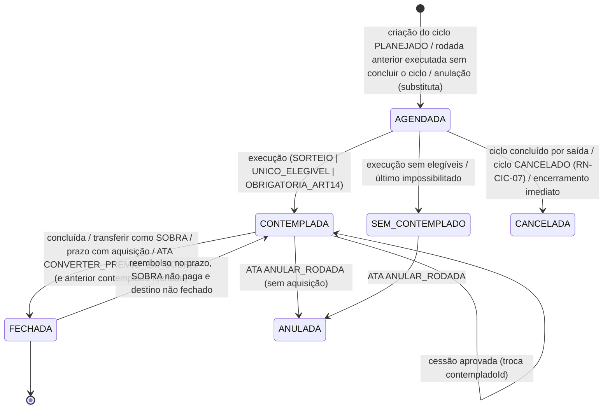
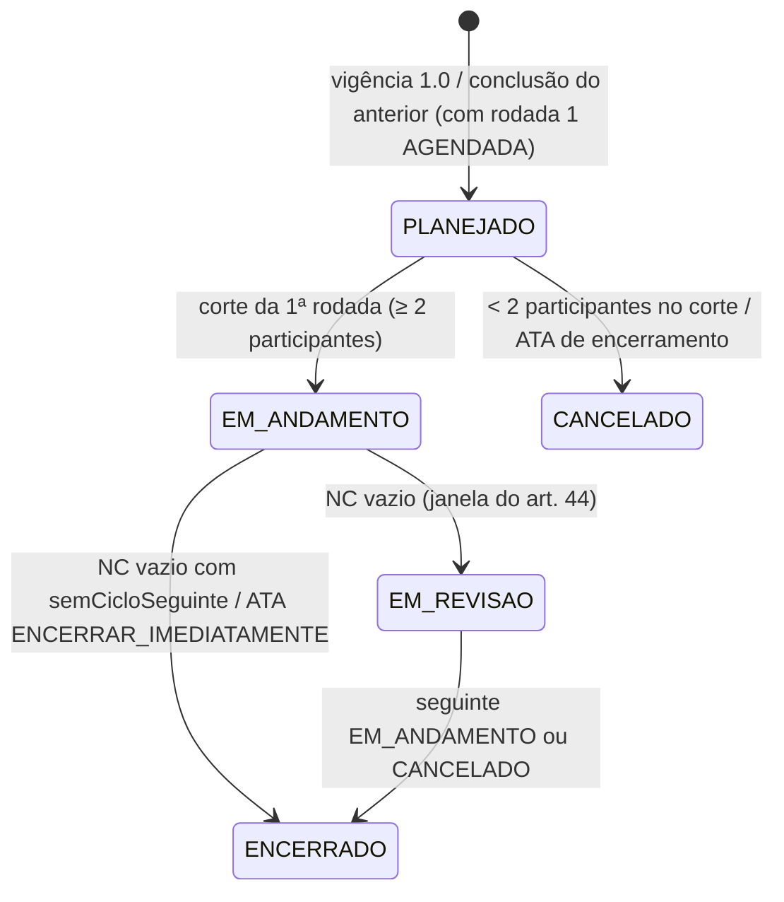
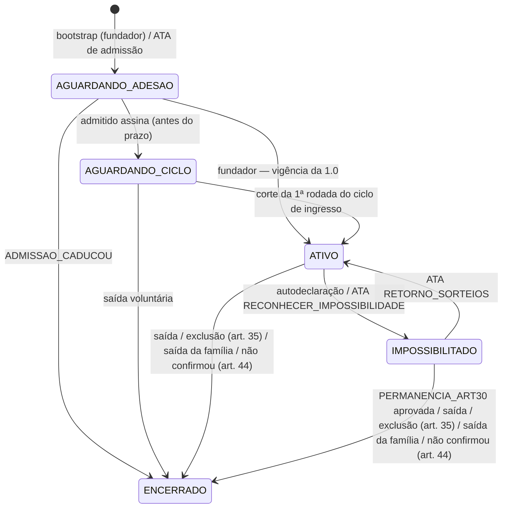
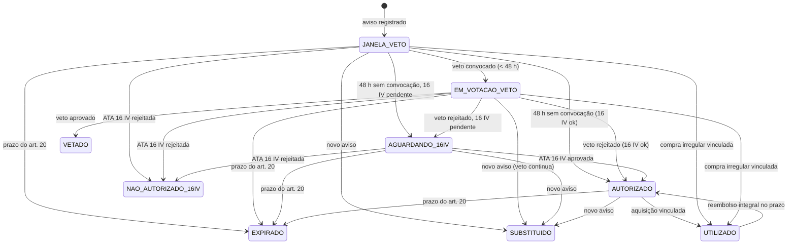
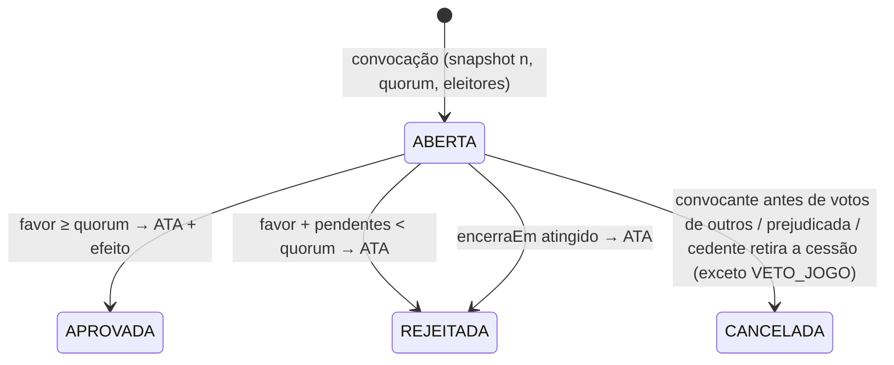
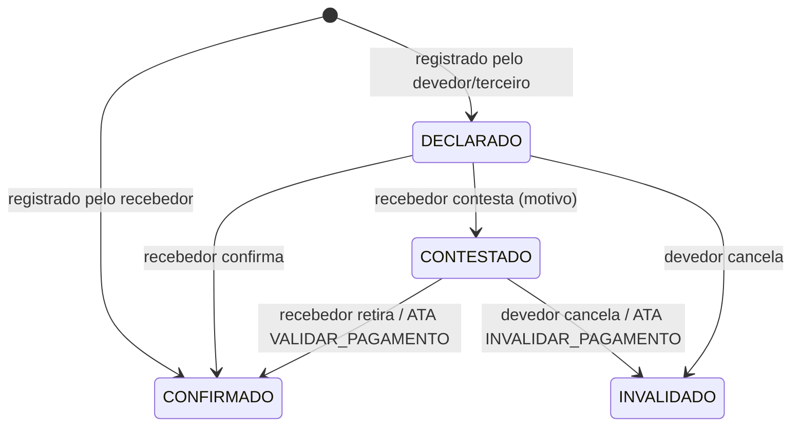
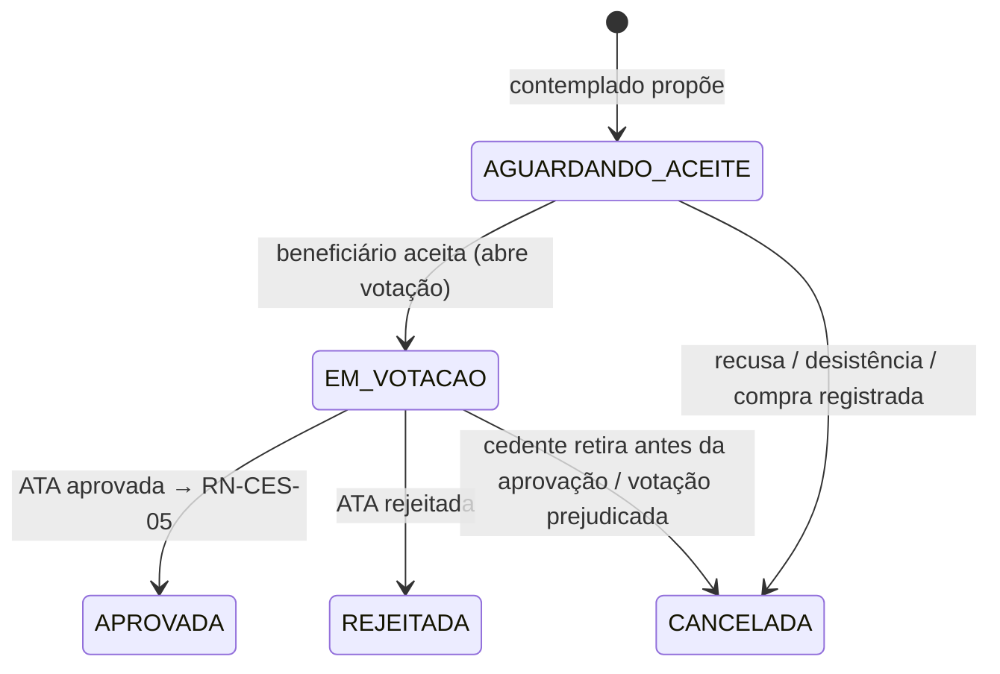
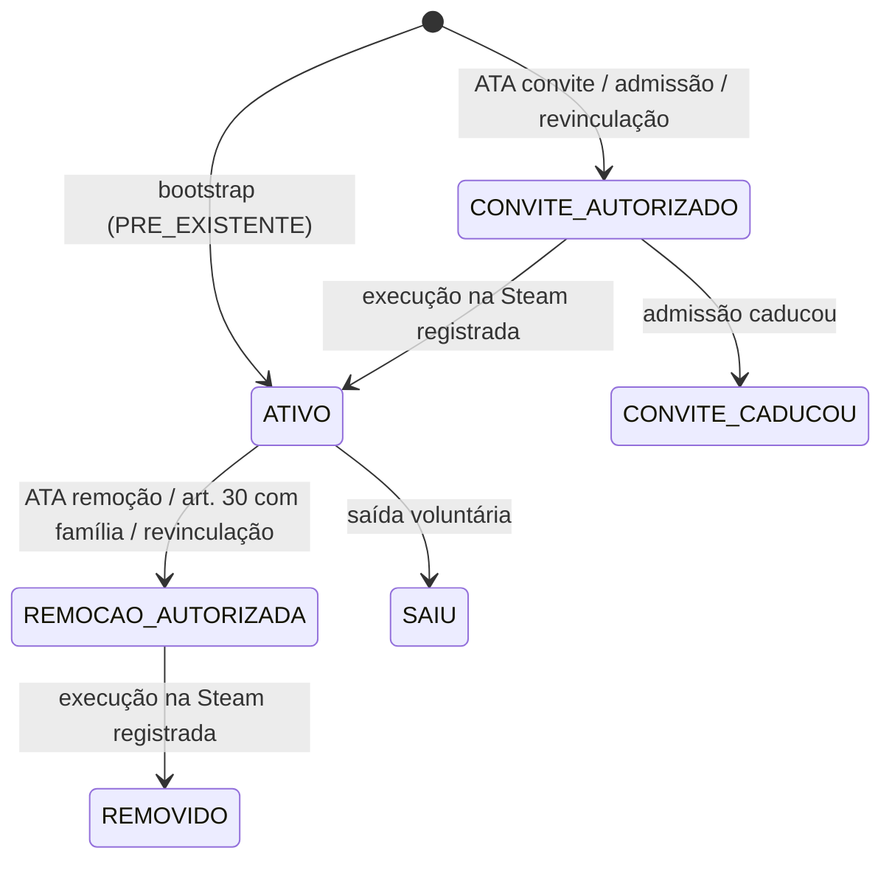

# 02 — Regras de negócio

Cada regra traz o artigo de origem. **(D-nn)** indica que parte da regra vem de interpretação registrada em [03](03-decisoes-de-interpretacao.md). As regras de acesso (RN-ACE) estão em [04](04-acessos-e-perfis.md) e as da Steam (RN-STM) em [06](06-integracao-steam.md).

---

## 0. Convenções de cálculo

| Id | Convenção |
|---|---|
| **C-TEMPO** | Instantes são `timestamptz` (UTC). O relógio é **o do servidor Node** (`agora()`), nunca o do banco nem o do cliente. SQL de negócio não usa `now()`: o serviço passa todo instante de negócio de forma explícita. Datas de negócio (dia do sorteio, data de ATA, vencimentos) são calculadas no fuso IANA `America/Sao_Paulo`, nunca com *offset* fixo. **Fim do dia D** = `D+1 00:00:00` local, como limite **exclusivo** (`instante < limite`). |
| **C-DATA** | `type DataCivil = string // 'AAAA-MM-DD'`. Um campo `@db.Date` só recebe `paraDb(dataLocal(instante))`, com `paraDb(d) = new Date(d + 'T00:00:00Z')`. É lido com `deDb(x) = x.toISOString().slice(0, 10)` e **nunca** é formatado com fuso. `fimDoDia`, `somarDiasCorridos` e `somarAnos` recebem `DataCivil`. |
| **C-DIAS** | "N dias corridos contados de D" vence no **fim do dia D+N**, sem contar o dia inicial (D-22). Ex.: sorteio 03/10/2026 → +7 = 10/10 e +30 = 02/11/2026; 03/02/2027 → +30 = 05/03/2027. |
| **C-HORAS** | "N horas contadas de t" = `t + N×3600 s` exatos. |
| **C-DINHEIRO** | Centavos inteiros (`Int`), sem ponto flutuante. A única divisão é o rateio (RN-FIN-17), com regra de resto explícita. |
| **C-HASH** | `jsonCanonico(v)` = JSON sem espaços, com chaves ordenadas recursivamente por *code point*, e strings e números como no `JSON.stringify`. `VersaoRegulamento.sha256 = sha256hex(utf8(textoMarkdown com LF e sem BOM) + "\n" + jsonCanonico(parametros))`. `Sorteio.snapshotSha256 = sha256hex(utf8(jsonCanonico(snapshot)))`. `Ata.sha256 = sha256hex(utf8(markdown))`. O diretório `docs/regulamento/` fica fora do Prettier, para não mudar o hash. |
| **C-DERIVADO** | Estados temporais (atraso, "em dia", postergação, status do aviso, votação vencida) são **funções puras** `f(fatos, agora)` em `src/domain`. O banco guarda fatos: atos e instantes. O `tick` só **materializa** o que precisa de efeito: sorteio, ATA de votação vencida, fechamento por prazo e SOBRA/rateio. |
| **C-PARAM** | Números do Regulamento (R$ 25, dia 3, 48 h, 7 e 30 dias) vêm dos `parametros` da versão (RN-REG-06), nunca de constantes. Prazos e prorrogação de uma obrigação usam a versão gravada em `rodada.versaoRegulamentoId`. |

---

## 1. Gerais (RN-GER)

- **RN-GER-01 — Sem administrador** (art. 3º). Não existe papel, flag nem tela de administração. Todo poder que seria de um admin (corrigir registro de terceiro, bloquear jogo, excluir membro, anular sorteio, alterar regra) só ocorre como **efeito de votação aprovada** (RN-VOT-07).
- **RN-GER-02 — Sem custódia** (art. 3º, p.u.). Não há saldo nem conta do consórcio. Toda `Obrigacao` tem uma pessoa devedora e uma credora. O `Pagamento` registra um Pix feito diretamente entre elas.
- **RN-GER-03 — Imutabilidade.** `Sorteio`, `Voto`, `Ata`, `Adesao` e `EventoAuditoria` só aceitam inserção (trigger). `Obrigacao`, `Pagamento`, `AvisoCompra` e `Aquisicao` nunca são apagados; mudam de estado com autor, instante e motivo. A correção de fatos só ocorre por votação de caso omisso com efeito tipado (RN-VOT-09).
- **RN-GER-04 — Auditoria.** Toda mutação grava um `EventoAuditoria` na **mesma transação**: ator (`MEMBRO`, `SISTEMA` ou `OPERADOR`), ação, entidade, antes/depois e ATA quando houver. `registrarEvento` **mascara** todo campo `chavePix*` (4 últimos caracteres) e **descarta** `conteudo` e `tokenHash` antes de gravar. Todos os membros leem a trilha (arts. 39 e 40).
- **RN-GER-05 — Transcrição de ato praticado no GRUPO** (D-01). Enquanto o GRUPO for canal válido, qualquer membro pode registrar em nome de outro **só** estes atos, anexando print obrigatório e o horário da mensagem (`efetivaEm`):

  | Ato | Limite para transcrever |
  |---|---|
  | `NAO_CONCORRER` | `registradaEm < corte` da rodada (RN-SOR-03) |
  | `CONFIRMA_PROXIMO_CICLO` / `RECUSA_PROXIMO_CICLO` | `efetivaEm` e `registradaEm` < `prazoConfirmacao(dataInicio)`. O sujeito pode revogar até o corte da 1ª rodada, mesmo depois do prazo |
  | `JUSTIFICATIVA_PRORROGACAO` | com `efetivaEm < vencimentoEm`, aceita até 48 h depois do `vencimentoEm` |

  O registro fica marcado "transcrito por <nome>" e aparece nas pendências do sujeito. A transcrição **nunca altera um corte já executado**; divergências vão para caso omisso (ex.: `ANULAR_RODADA`).

  **Nunca são transcritos**, porque exigem o próprio titular autenticado: impossibilidade de pagamento, saída do consórcio, saída da família, voto, aceite de Regulamento, aviso de compra, registro de compra e aceite de cessão. O próprio titular pode registrar impossibilidade ou saída informando como `efetivaEm` o horário da mensagem no GRUPO, com print, até 48 h depois. Mesmo assim, o efeito começa em `registradaEm`: sorteios e contribuições já gerados ficam como estão. Se o titular não registra, cabe ATA de caso omisso (`RECONHECER_IMPOSSIBILIDADE`, `RECONHECER_SAIDA`).
- **RN-GER-06 — Concorrência.** `travar(tx, chave)` = `pg_advisory_xact_lock(hashtextextended(chave, 0))`. Chaves:
  - `'fechamento'` (global, **sempre o primeiro lock** da transação): `fecharRodada` (inclusive a cascata), reembolso e reabertura, SOBRA complementar (RN-FIN-16) e toda criação de SOBRA e rateio (RN-SOR-10.3, tick). Evita *write skew* entre rodadas vizinhas. *ponytail:* serializa esses fluxos, o que com 5 pessoas não custa nada.
  - `'rodada:'+id`: execução do sorteio × declaração de não concorrer; operações da rodada.
  - `'votacao:'+id`: voto × voto × encerramento.
  - `'ata'`: numeração de ATA e de entrada do Anexo I.
  - Dentro do lock, o serviço relê o estado antes de agir.
- **RN-GER-07 — Idempotência.** O `tick` e os efeitos de votação podem rodar de novo sem duplicar nada, porque as constraints únicas garantem (05 §3):
  - `Sorteio.rodadaId`;
  - `contribuicao_por_devedor`;
  - `sobra_unica` (rodada de origem, reembolso);
  - `rateio_unico` (rodada de origem, credor, reembolso);
  - `obrigacao_por_pagamento`;
  - `Ata.votacaoId`;
  - `rodada_sequencia_unica`, `rodada_mes_unico` e `veto_unico_por_aviso`.
- **RN-GER-08 — Texto para o GRUPO.** Todo evento relevante oferece "Copiar para o GRUPO" com texto pronto, **sem chave Pix e sem comprovante**, e o link da página ([07 §5](07-telas-e-rotas.md#5-textos-para-o-grupo)).

---

## 2. Regulamento e versões (RN-REG)

- **RN-REG-01 — Versão 1.0** (arts. 45 e 46). Carregada no bootstrap (RN-ACE-10) a partir de `docs/regulamento/regulamento-v1.0.md`, com `sha256` conforme C-HASH, parâmetros (RN-REG-06) e Anexo I, entrada 01 (RN-BLO-01). Fica **vigente no instante da última adesão válida** dos fundadores (`adesaoValida`, 05 §4): `vigenteDesde` = `assinadaEm` dessa adesão. Na mesma transação nasce o ciclo 1 (RN-CIC-01).
- **RN-REG-02 — Antes da vigência.** Só estão disponíveis login, onboarding, leitura do texto e adesão. Não se cria rodada, obrigação nem votação.
- **RN-REG-03 — Nova versão** (art. 42). Só como efeito de votação `ALTERACAO_REGULAMENTO` aprovada. A proposta traz o texto integral (feito a partir da última versão aprovada), o resumo das mudanças e os parâmetros. `ordem` = maior `ordem` + 1; `numero` = `"1." + ordem` (1.1, 1.2, …, 1.10). `vigenteDesde` = 00:00 (SP) do **dia 1º do mês civil seguinte** à data (SP) de encerramento da votação (D-20). Ex.: aprovada em 30/09 às 23:00 → vale em 01/10; aprovada em 01/10 às 10:00 → vale em 01/11.
- **RN-REG-04 — Versão vigente em t** = a de maior `ordem` com `vigenteDesde ≤ t`. Duas aprovadas no mesmo mês: vale a de maior `ordem`; a outra fica "superada antes da vigência". Só pode haver **uma** votação de alteração aberta por vez (D-32).
- **RN-REG-05 — Qual versão rege cada ato.** A votação usa a versão vigente na **convocação** (quórum, duração). A rodada usa a versão vigente no **corte** (contribuição, horário, prazos), gravada em `rodada.versaoRegulamentoId`.
- **RN-REG-06 — Parâmetros versionados** (zod): `contribuicaoCentavos` (2500), `diaSorteio` (3), `horaSorteio` ("12:00", D-03), `horasJanelaVeto` (48), `horasVotacao` (48), `diasPrazoCompra` (30), `diasProrrogacao` (7), `membrosPrevistos` (5), `capacidadeFamilia` (6, regra Steam informativa). Mudança de regra que **não** é parâmetro exige alteração de código antes da vigência; a versão aprovada mostra esse alerta.
- **RN-REG-07 — Assinatura** (bloco de assinaturas; arts. 6º e 46). Aceite eletrônico do próprio titular autenticado, com a declaração literal, o `sha256` da versão e o snapshot de nome, nick, código de amigo e **chave Pix mascarada** (4 últimos caracteres). PDF assinado é anexo opcional. Membros atuais **não** reassinam versões novas, salvo depois de `REVINCULAR_STEAM` (RN-VOT-09); novos membros assinam a vigente (D-21).

---

## 3. Cadastros, membros e família (RN-CAD)

- **RN-CAD-01 — Pessoa e identidade Steam.** `steamId64` único, com 17 dígitos, entre `76561197960265729` e `76561202255233023`. Código de amigo = `steamId64 − 76561197960265728`. O nick é só exibição.
- **RN-CAD-02 — Requisitos de MEMBRO ativo** (art. 2º, II). São cumulativos: vínculo `IntegranteFamilia` ATIVO; maioridade autodeclarada; adesão válida; nome, `steamId64` e chave Pix preenchidos. Durante uma revinculação (RN-VOT-09 `REVINCULAR_STEAM`), o membro continua `ATIVO` enquanto o convite da nova conta aguarda execução.
- **RN-CAD-03 — Um vínculo por pessoa.** No máximo um `Membro` não encerrado por pessoa (índice parcial). Na adesão, a pessoa declara que não participa com outra conta Steam.
- **RN-CAD-04 — Estados do vínculo de membro:** `AGUARDANDO_ADESAO` → (`AGUARDANDO_CICLO` | `ATIVO`) → `ATIVO` ⇄ `IMPOSSIBILITADO` → `ENCERRADO` (com motivo). Diagrama no §12.3. **Todo encerramento** com motivo `SAIDA_VOLUNTARIA`, `SAIDA_DA_FAMILIA`, `EXCLUSAO_ART30` ou `EXCLUSAO_ART35` grava, na mesma transação, `ParticipacaoCiclo.saiuEm` = instante do encerramento na participação do ciclo `EM_ANDAMENTO` ou `EM_REVISAO`, e reavalia a conclusão do ciclo (RN-CIC-04). `NAO_CONFIRMOU_ART44` e `ADMISSAO_CADUCOU` **não** gravam `saiuEm`.
- **RN-CAD-05 — Chave Pix.** Só o titular altera a própria chave. A troca é auditada mascarada. Se ele for credor de obrigação aberta, os pagadores veem "chave alterada em DD/MM HH:MM". Cada `Pagamento` guarda `chavePixDestinoMascarada`, a chave exibida no registro. A tela recomenda chave **aleatória**.
- **RN-CAD-06 — Integrante que não é membro** (arts. 7º e 35). Cadastro mínimo: apelido e, opcionalmente, `steamId64`. Sem login, chave Pix nem voto; não conta para quórum nem concorre. Pode ser conta infantil.
- **RN-CAD-07 — Integrantes pré-existentes.** Cadastrados no bootstrap com origem `PRE_EXISTENTE`, com `entrouEm` informado e sem ATA.
- **RN-CAD-08 — Convite de integrante** (art. 7º). Exige ATA aprovada (`CONVITE_INTEGRANTE`, ou `ADMISSAO_MEMBRO` com inclusão). O efeito cria o vínculo `CONVITE_AUTORIZADO` (com `steamId64`). Qualquer membro registra "executado na Steam em <data>" → `ATIVO`. Se a admissão da mesma ATA caducar (RN-CAD-12.5), o vínculo vai a `CONVITE_CADUCOU`, sem bloqueio de vaga. Não existe entrada sem ATA; um convite feito fora do rito é tratado por caso omisso.
- **RN-CAD-09 — Remoção de integrante** (arts. 7º e 35). ATA `REMOCAO_INTEGRANTE` aprovada → vínculo `REMOCAO_AUTORIZADA`. Qualquer membro registra a execução na Steam → `REMOVIDO`, com `saiuEm`. Se o removido for membro, o vínculo de membro é **encerrado na aprovação** (`EXCLUSAO_ART35`, com `saiuEm` pela RN-CAD-04); aplicam-se RN-SAI-02/03.
- **RN-CAD-10 — Saída voluntária da família.** Ato **próprio** (`Declaracao SAIDA_FAMILIA`), sem votação. O vínculo vira `SAIU`. Se a pessoa é membro, o vínculo de membro encerra junto (`SAIDA_DA_FAMILIA`), com os efeitos dos arts. 32 e 33. Sair do consórcio não tira ninguém da família.
- **RN-CAD-11 — Bloqueio de vaga** (art. 35, p.u.; art. 36, II; D-30). Ao encerrar um vínculo de integrante, `vagaBloqueadaAte = somarAnos(entrouEm ?? saiuEm, 1)` (29/02 → 28/02). Se o resultado for ≤ `saiuEm`, não há bloqueio. O campo é editável com justificativa, porque a Steam é a fonte. Vagas livres = `capacidadeFamilia − integrantes ATIVOS − vagas com bloqueio vigente`; com ≤ 0, registrar convite mostra o alerta "provável recusa pela Steam", sem bloquear.
- **RN-CAD-12 — Admissão de novo membro** (art. 6º):
  1. Votação `ADMISSAO_MEMBRO`, efeito `{nome, steamId64, incluirNaFamilia}`. Se a pessoa ainda não é integrante, `incluirNaFamilia = true` e a mesma ATA vale para o art. 7º.
  2. Aprovada: cria a `Pessoa` (se nova), o `Membro` `AGUARDANDO_ADESAO` e, se for o caso, o integrante `CONVITE_AUTORIZADO`. O SteamID passa a poder logar.
  3. O candidato entra com Steam, completa os dados, declara a maioridade e assina a versão vigente → `AGUARDANDO_CICLO`. Com `agora ≥ prazoConfirmacao(dataInicio)` do próximo ciclo, a assinatura é recusada.
  4. No **corte da 1ª rodada do próximo ciclo**, fica `ATIVO` e ganha `ParticipacaoCiclo` se estiver `AGUARDANDO_CICLO`, com adesão válida com `assinadaEm < prazoConfirmacao` e integrante `ATIVO`.
  5. Sem adesão válida até o prazo, a admissão **caduca** no mesmo corte: `ENCERRADO(ADMISSAO_CADUCOU)`, e o convite da mesma ATA vai a `CONVITE_CADUCOU` (D-32). Readmitir exige nova votação.
  6. Se assinou mas o convite na Steam não foi registrado como executado, a ativação fica para o ciclo seguinte e aparece uma pendência.
- **RN-CAD-13 — Limite de membros** (arts. 4º e 5º, §2º; D-16). A ativação que leve o ciclo a mais de `membrosPrevistos` participantes exige versão vigente no corte com `membrosPrevistos ≥ N`. Sem isso, o candidato fica para o ciclo seguinte, e a convocação já mostra o alerta. Ciclos com menos de 5 são permitidos, com alerta.
- **RN-CAD-14 — Readmissão de ex-membro.** Segue a RN-CAD-12. Os votantes veem as pendências antigas e a vaga bloqueada, só como informação.
- **RN-CAD-15 — Anonimização.** O ex-membro com perfil `EX_QUITADO` (sem pendência e sem ser pagante de ciclo em andamento) pode pedir anonimização. Em `Pessoa` saem `chavePix`, `steamNick`, `steamAvatarUrl` e `steamPerfilUrl`. Snapshots imutáveis (`Adesao`, `Sorteio`, `Ata`, `EventoAuditoria`, que já guardam a chave só mascarada) e comprovantes anexados **não mudam**: o nome e o nick assinados ficam como registro do acordo.

---

## 4. Ciclo (RN-CIC)

- **RN-CIC-01 — 1º ciclo** (art. 46; D-02). Na vigência da 1.0, na mesma transação, nasce o ciclo 1 `PLANEJADO`:
  - `dataInicio` = primeiro dia 3 **estritamente posterior** à data (SP) da última adesão;
  - junto nasce a **rodada 1** `AGENDADA` (sequência 1, `mesReferencia` = mês de `dataInicio`, `agendadaPara` pela RN-SOR-01);
  - participantes previstos: os fundadores.
  - Hoje (24/09/2026): com todos assinando até 02/10, o ciclo começa em 03/10/2026; senão, em 03/11/2026.
- **RN-CIC-02 — Início.** `PLANEJADO` → `EM_ANDAMENTO` no corte da 1ª rodada, se houver pelo menos 2 participantes (RN-CIC-07).
- **RN-CIC-03 — Participantes** (art. 44). **Participantes previstos** de um ciclo `PLANEJADO`:
  - no ciclo 1: os fundadores `ATIVO` ou `IMPOSSIBILITADO`;
  - nos demais: os membros com `CONFIRMA_PROXIMO_CICLO` válida e `cicloId` = o `PLANEJADO`, mais os admitidos `AGUARDANDO_CICLO` que atendem à RN-CAD-12.4.
  - No corte da 1ª rodada, os previstos viram `ParticipacaoCiclo` (`entrouEm = corte`). Não participa quem recusou ou ficou em silêncio (D-17).
- **RN-CIC-04 — Conclusão** (art. 2º, III). Quando o conjunto NC (participantes com `saiuEm` nulo e ainda não contemplados) fica vazio, pela última contemplação ou pela saída do último não contemplado:
  - com **`semCicloSeguinte = true`**, o ciclo vai direto a `ENCERRADO` (`concluidoEm`, `encerradoEm`), sem janela e sem ciclo seguinte, e aplica-se a RN-FIN-17;
  - senão, o ciclo vai a `EM_REVISAO` (`concluidoEm`) e nasce o ciclo seguinte `PLANEJADO`, com a rodada 1 `AGENDADA`. `dataInicio` = primeiro dia 3 **≥ data (SP) de `concluidoEm` + 8 dias**, o que garante pelo menos 7 dias corridos de janela (D-17). Ex.: conclusão em 03/02 → 03/03; em 24/11 → 03/12; em 30/11 → 03/01.
  - Uma rodada `AGENDADA` que ainda reste no ciclo concluído é `CANCELADA`.
  - Obrigações, aquisição e sobra das rodadas contempladas seguem normalmente.
- **RN-CIC-05 — Janela de revisão** (art. 44; D-17). Vai de `concluidoEm` até `prazoConfirmacao(dataInicio)` (derivado: `dataInicio` 00:00 SP, isto é, o fim do dia 2). Nela cada membro confirma ou recusa, e pode mudar de ideia até o prazo. Podem ocorrer votações de alteração e de admissão. O sistema alerta que, para valer já no 1º sorteio, a alteração precisa ser **aprovada até o último dia do mês anterior** (RN-REG-03).
- **RN-CIC-06 — Quem não confirma** continua MEMBRO, votando e contando no quórum, até o corte da 1ª rodada do novo ciclo. Nesse corte, o `Membro` é encerrado com `NAO_CONFIRMOU_ART44`, **sem gravar `saiuEm`** (RN-CAD-04). A família não muda e as dívidas continuam.
- **RN-CIC-07 — Sem ciclo seguinte** (art. 25, §3º; art. 38, p.u.). Se no corte da 1ª rodada houver menos de 2 participantes, ou se uma ATA de encerramento for aprovada com o ciclo seguinte já `PLANEJADO`:
  - o `PLANEJADO` vai a `CANCELADO` e a rodada 1 dele a `CANCELADA`;
  - o ciclo anterior vai a `ENCERRADO`, com `semCicloSeguinte = true`;
  - aplica-se o rateio (RN-FIN-17).
- **RN-CIC-08 — Encerramento.** `EM_REVISAO` → `ENCERRADO` quando o ciclo seguinte entra em andamento ou é cancelado.
- **RN-CIC-09 — Duração variável** (art. 2º, III sobre o art. 4º; D-06). Meses do ciclo = rodadas com contemplado + rodadas `SEM_CONTEMPLADO`.
- **RN-CIC-10 — Encerramento do consórcio** (art. 38, p.u.). É efeito de `CONTINUIDADE_CONSORCIO`:
  - `ENCERRAR_AO_FIM_DO_CICLO` (default): com o ciclo `EM_ANDAMENTO`, grava `semCicloSeguinte = true` e `ataEncerramentoNumero`; se o ciclo já estiver `EM_REVISAO`, aplica-se na hora a RN-CIC-07;
  - `ENCERRAR_IMEDIATAMENTE`: cancela as rodadas `AGENDADA`, encerra o ciclo (`encerradoEm`, `semCicloSeguinte`) e aplica o rateio. O sistema **não** calcula restituições aos não contemplados; elas ficam na ATA e em efeitos `CRIAR_DEVOLUCAO`.
- **RN-CIC-11 — Adiamento.** O efeito de caso omisso `ADIAR_CICLO {cicloId, novaDataInicio}` (sempre um dia 3) move o início de um ciclo `PLANEJADO`, com seu prazo de confirmação e a rodada 1.

---

## 5. Rodada e sorteio (RN-SOR)

- **RN-SOR-01 — Agendamento** (art. 8º). `agendadaPara` = `diaSorteio` do mês de referência às `horaSorteio` (SP), pelos parâmetros da versão vigente naquele dia. O tick recalcula as `AGENDADA` se uma nova versão com outro horário entrar em vigor antes do corte, **exceto a substituta de anulação** (`rodadaAnuladaId ≠ null`), cujo `agendadaPara` é fixo (RN-SOR-13). Rodadas se sobrepõem: a do mês M+1 é agendada enquanto a do mês M está em fase de compra.
- **RN-SOR-02 — Execução** (arts. 8º e 9º; D-03). Executa o **tick** quando `agora ≥ agendadaPara` ou, como reserva, **qualquer membro** pelo botão "Realizar sorteio", liberado só com `agora ≥ agendadaPara` e a rodada `AGENDADA`. Nunca antes do horário. Rodadas do mesmo ciclo são executadas em ordem de sequência, **ignorando `ANULADA` e `CANCELADA`**. Há uma execução por rodada (`travar` + `UNIQUE(Sorteio.rodadaId)`); um segundo disparo só mostra o resultado existente.
- **RN-SOR-03 — Corte** (art. 12). `T = agora()`, lido **depois** de `travar(tx, 'rodada:'+id)`. Uma declaração de não concorrer vale se foi registrada antes do lock e não revogada antes de `T`. Depois de `T`, é recusada.
- **RN-SOR-04 — Sorteio atrasado** (D-04). Se executado depois do fim do dia agendado, `atrasada = true` e `dataSorteio` = data (SP) do corte. Todos os prazos (arts. 11 e 20) contam dela. A rodada seguinte continua no dia 3 do mês seguinte ao de referência.
- **RN-SOR-05 — Algoritmo de elegibilidade** (arts. 10, 14, 29 e 30; D-05, D-08). Função pura `apurarSorteio(entrada, T)`:

  ```text
  P  = participantes do ciclo com entrouEm ≤ T e saiuEm nulo (ou > T)
  NC = P − {contempladoId de toda rodada do ciclo não ANULADA/CANCELADA}
       // quem cedeu por cessão aprovada volta a NC; o cessionário sai de NC
  se |NC| = 0  → erro de consistência (o ciclo já devia estar concluído)
  se |NC| = 1  (art. 14):
      u = único elemento de NC
      se u está IMPOSSIBILITADO → SEM_CONTEMPLADO(ULTIMO_IMPOSSIBILITADO)             (D-05)
      senão                     → CONTEMPLADA(OBRIGATORIA_ART14, u)
                                   // ignora arts. 12 e 13 e também atraso/postergação (D-05)
  senão:
      C0      = NC − impossibilitados em T      // o impossibilitado não bloqueia postergados (D-08)
      normais = { m ∈ C0 | ¬postergado(m, ciclo, T) }                               (art. 29)
      camada  = normais ≠ ∅ ? normais : C0
      elegiveis = { m ∈ camada | emDia(m, T) ∧ ¬optouNaoConcorrer(m, rodada, T) }    (art. 10, II e IV)
      |elegiveis| = 0 → SEM_CONTEMPLADO(NENHUM_ELEGIVEL)
      |elegiveis| = 1 → CONTEMPLADA(UNICO_ELEGIVEL, único)
      senão           → CONTEMPLADA(SORTEIO, escolher(elegiveis, rng))
  ```

  - Um normal que optou por não concorrer **continua na camada dos normais** e bloqueia os postergados (D-08).
  - Motivos exibidos por pessoa: `JA_CONTEMPLADO`, `IMPOSSIBILITADO`, `POSTERGADO_AGUARDANDO_DEMAIS`, `NAO_EM_DIA`, `OPTOU_NAO_CONCORRER`.
- **RN-SOR-06 — Em dia** (art. 10, II). `emDia(m, T)` é verdadeiro se, e só se, **não** existe `CONTRIBUICAO` de `m` (qualquer ciclo), não cancelada e não autoquitada, com `vencimentoEfetivo ≤ T` e saldo > 0 pelos pagamentos que contam (RN-FIN-06). SOBRA, repasse, rateio e devolução **não** entram (D-19).
- **RN-SOR-07 — Postergação** (art. 29; D-08). `postergado(m, C, T)` é verdadeiro se:
  - (a) existe `CONTRIBUICAO` de `m`, de rodada de `C`, com `emAtraso(o, T)` (RN-FIN-08), isto é, `vencimentoEfetivo ≤ T` sem quitação até o vencimento; ou
  - (b) no corte da 1ª rodada de `C`, `m` tinha `CONTRIBUICAO` de ciclo anterior vencida com saldo > 0, considerando os pagamentos com `pixEm` < esse corte.
  - É **pegajosa** em `C`: pagar depois não a remove. Não passa para `C+1`, exceto pela condição (b). Como é derivada, um registro tardio com `pixEm` no prazo a desfaz, e um pagamento invalidado a restabelece.
  - Para quem já foi contemplado, não tem efeito além da dívida (lacuna, D-08).
- **RN-SOR-08 — Sorteio aleatório e registro** (art. 9º). `escolher(elegiveis, rng)` ordena por `pessoaId` e usa `indice = rng(n)`, com `crypto.randomInt(0, n)` em produção (RNG injetado). O `Sorteio` (só inserção) grava:
  - `corteEm`, `disparadoPorId` (nulo = SISTEMA), `algoritmoVersao`;
  - o snapshot canônico com, por participante: pessoa, nome, contemplado, impossibilitado, postergado (e a obrigação que postergou), emDia (e as obrigações vencidas em aberto), declaração, camada, elegível e motivos;
  - `snapshotSha256` (C-HASH), `elegiveisIds`, `indice` e `contempladoId`.
  - *ponytail:* a semente vem do servidor, o que deixa confiança residual no operador. Upgrade: usar um round futuro do drand e publicar o hash antes.
- **RN-SOR-09 — Publicidade** (arts. 9º e 40). Resultado visível na hora: elegíveis, motivos, hash e índice. Texto pronto para o GRUPO. Qualquer membro anexa evidências (print ou link https de gravação), que só se acumulam. Sem nenhuma evidência, fica a pendência coletiva "anexar captura do sorteio", exceto se for adotada a redação do 03 §3.2 (D-03), que faz da página o registro do sorteio.
- **RN-SOR-10 — Efeitos da contemplação** (mesma transação), em ordem:
  1. a rodada vai a `CONTEMPLADA`, com `tipoContemplacao`, `sorteadoOriginalId = contempladoId`, `executadaEm`, `dataSorteio`, `contribuicaoCentavos`, `versaoRegulamentoId` e `prazoCompraAte = fim do dia (dataSorteio + diasPrazoCompra)`;
  2. gera as contribuições (RN-FIN-02) e grava `pagantesNoCorte`;
  3. liga a SOBRA pendente (RN-FIN-14);
  4. **se NC ficou vazio, conclui o ciclo (RN-CIC-04); senão, cria a próxima rodada** (regra única de criação, também usada pela RN-SOR-11): `AGENDADA`, com sequência + 1 e o mês seguinte, **salvo se já existir** no ciclo rodada não `ANULADA`/`CANCELADA` com essa sequência.
- **RN-SOR-11 — Rodada sem contemplado** (D-06). Não gera obrigação nem prazo. O ciclo ganha um mês, a próxima rodada é criada pela regra da RN-SOR-10.4 (sem duplicar uma já existente) e a SOBRA pendente espera. Pendências:
  - 2 rodadas `SEM_CONTEMPLADO` seguidas no ciclo → "deliberar caso omisso";
  - `ULTIMO_IMPOSSIBILITADO` → "deliberar permanência (art. 30)", mas só se não houver ATA `PERMANENCIA_ART30` sobre a pessoa desde `impossibilitadoDesde`; se houver ATA rejeitada, a pendência passa a "convocar `RETORNO_SORTEIOS` ou caso omisso".
- **RN-SOR-12 — Não concorrer** (art. 12). Ato próprio (ou transcrito, RN-GER-05), sem aprovação, só para a rodada `AGENDADA` corrente do ciclo em que a pessoa participa (ou, na rodada 1, é participante previsto, RN-CIC-03) e não foi contemplada. Revogável até o corte. Não muda obrigações (art. 5º, §1º). Indisponível com |NC| = 1; ignorada no corte se valer o art. 14 ou se o declarante não estiver em P.
- **RN-SOR-13 — Anulação** (arts. 9º e 43; D-28). Só por ATA de caso omisso `ANULAR_RODADA {rodadaId}`, e só se: a rodada não tem `Aquisicao`; o ciclo dela está `EM_ANDAMENTO`; e **nenhuma rodada do ciclo com sequência maior** está `CONTEMPLADA`, `SEM_CONTEMPLADO` ou `FECHADA`. Faltando alguma condição, a ATA registra "efeito não aplicável" (RN-VOT-07), e a correção segue por `CANCELAR_OBRIGACAO`/`CRIAR_DEVOLUCAO`. Efeitos (mesma transação):
  1. A rodada original vai a `ANULADA` e continua visível.
  2. Nasce a **substituta**, com a **mesma `sequencia` e o mesmo `mesReferencia`** e `rodadaAnuladaId` apontando para a original. Fica `AGENDADA` com `agendadaPara` = `horaSorteio` (SP, versão vigente) do **dia seguinte à data da ATA**, sem recálculo (RN-SOR-01). Não é marcada `atrasada`.
  3. Todas as obrigações **não canceladas** com `rodadaId` = anulada (`CONTRIBUICAO`, inclusive autoquitadas, `SOBRA` e `REPASSE_CESSAO`) são **canceladas** (motivo `ANULACAO`), pagas ou não. `DEVOLUCAO`s já existentes (de cessão) **não** são canceladas.
  4. Para cada pagamento que conta nas obrigações canceladas **neste passo**, nasce `DEVOLUCAO` `recebedorId → devedor`, do mesmo valor, com `pagamentoOrigemId`, vencendo no fim do dia da ATA (+7). Pagamento registrado depois da ATA segue a RN-FIN-04 (registro em obrigação cancelada); a invalidação posterior segue a RN-FIN-05.
  5. As SOBRAs canceladas (principal e complementares) voltam a ficar pendentes e renascem na contemplação da substituta ou da próxima contemplada (RN-FIN-14/16).
  6. As declarações `NAO_CONCORRER` e `JUSTIFICATIVA_PRORROGACAO` não revogadas da rodada anulada são copiadas para a substituta e podem ser revogadas até o novo corte.
  7. Avisos e cessões da anulada perdem efeito. Votações de veto seguem, e o efeito no Anexo I continua valendo.
  8. Os prazos contam do novo sorteio.
- **RN-SOR-14 — Sem "refazer".** Nenhuma outra via altera ou repete um sorteio.

---

## 6. Financeiro (RN-FIN)

### 6.1 Obrigações

- **RN-FIN-01 — Tipos:** `CONTRIBUICAO`, `SOBRA`, `REPASSE_CESSAO`, `RATEIO_SOBRA`, `DEVOLUCAO`. Valor > 0 centavos. `autoquitada` ⇔ devedor = credor (CHECK).
- **RN-FIN-02 — Contribuições da rodada** (arts. 5º, 11, 31 e 33). Na contemplação, cada **pagante** diferente do contemplado ganha `CONTRIBUICAO {valor = rodada.contribuicaoCentavos, credor = contemplado, vencimentoEm = fim do dia de dataSorteio}`. O contemplado ganha uma autoquitada, que entra no prêmio sem Pix. `pagantesNoCorte` = número de contribuições criadas, contando a autoquitada.
  - **Pagantes:** participantes do ciclo em P no corte (inclui quem optou por não concorrer, postergados e impossibilitados) + ex-participantes que saíram **depois** de contemplados neste ciclo (arts. 31 e 33). Nos dois casos, **excluídos** os que têm `contribuicoesSuspensas` na participação do ciclo.
  - **Não são pagantes:** quem saiu antes de ser contemplado, nas rodadas com corte posterior à saída (art. 32).
- **RN-FIN-03 — Justificativa e prorrogação** (art. 11, p.u.; arts. 25 e 27, II; D-32). Toda justificativa é uma `Declaracao JUSTIFICATIVA_PRORROGACAO` do devedor (própria ou transcrita), com texto de pelo menos 10 caracteres:
  - **antes do sorteio**, com `rodadaId` da rodada `AGENDADA`: é copiada para a contribuição quando esta nasce;
  - **depois**, com `obrigacaoId`: vale se `efetivaEm < vencimentoEm`.
  - `Obrigacao.justificativa` e `justificadaEm` são cópias do texto e do `efetivaEm`.
  - `vencimentoEfetivo = justificadaEm < vencimentoEm ? addDays(vencimentoEm, diasProrrogacao, {in: tz(SP)}) : vencimentoEm`. Ex.: 04/10 00:00 → 11/10 00:00.
  - Não depende de aprovação e vale sempre o máximo de 7 dias. Vale para todos os tipos de obrigação, por analogia (o art. 25 remete ao art. 11).

### 6.2 Pagamentos

- **RN-FIN-04 — Registro de pagamento** (arts. 11, 39, I e 40).
  - **Campos:** obrigação; `valorCentavos` (≤ saldo; parcial permitido); `pixEm` (do comprovante, ≤ agora); comprovante (imagem ou PDF), **obrigatório, exceto em `formaDiversa`** (dinheiro, conta de terceiro), que só conta se `CONFIRMADO`; `recebedorId`; `chavePixDestinoMascarada`.
  - **Pagador** = `obrigacao.devedorId`, derivado no servidor e nunca vindo da entrada.
  - **`recebedorId`** (para quem foi o Pix):
    - default: o **credor vigente no instante `pixEm`**, derivado das cessões aprovadas da rodada (antes do `encerradaEm` de cada uma, vale o cedente dela);
    - a escolha entre o credor atual e os cedentes só existe em `CONTRIBUICAO`, `SOBRA` e `REPASSE_CESSAO` cujo credor foi redirecionado por cessão (RN-CES-05.4);
    - em `DEVOLUCAO` e `RATEIO_SOBRA`, `recebedorId = credorId`;
    - sempre `recebedorId ≠ devedor` (recusado com erro); o default descarta o cedente que for o próprio devedor.
  - **Quem registra:** devedor, credor ou qualquer membro. Registrado pelo **recebedor**, o pagamento nasce `CONFIRMADO`; pelos demais, `DECLARADO`.
  - **Anexo:** enviado antes por `enviarAnexoAcao` (RN-ACE-09). O mesmo anexo pode servir a mais de um pagamento do mesmo par devedor/recebedor; hash repetido em outro par gera alerta de duplicidade. `pixEm` anterior à criação da obrigação gera alerta, sem bloquear.
  - **Registro em obrigação cancelada:** aceita-se pagamento numa obrigação não autoquitada que foi cancelada por cessão (RN-CES-05.2) ou por anulação (RN-SOR-13.3), se `pixEm < canceladaEm` e `valorCentavos ≤ valor − pagos`. A obrigação não reabre. Quando o pagamento passa a contar, nasce `DEVOLUCAO` `recebedorId → devedor`, do mesmo valor (`pagamentoOrigemId`), vencendo no fim do dia desse evento (+7).
- **RN-FIN-05 — Confirmação, contestação, cancelamento e efeito da invalidação.**
  - Só o **recebedor** (`Pagamento.recebedorId`) confirma, contesta (motivo: `NAO_RECEBIDO`, `VALOR_DIVERGENTE` ou `DATA_DIVERGENTE`) ou retira a contestação.
  - Só o **devedor** da obrigação cancela um pagamento `DECLARADO` ou `CONTESTADO` (→ `INVALIDADO`). O terceiro que registrou **não** cancela, porque cancelar sozinho poderia postergar o devedor.
  - A contestação termina com a retirada pelo recebedor (→ `CONFIRMADO`), com o cancelamento pelo devedor, ou por ATA (`VALIDAR_PAGAMENTO` / `INVALIDAR_PAGAMENTO`). **Não** existe confirmação tácita.
  - **Efeito da invalidação:** quando um pagamento `p` fica `INVALIDADO`, toda obrigação não cancelada com `pagamentoOrigemId = p` (`REPASSE_CESSAO` ou `DEVOLUCAO`) é cancelada (motivo `pagamento_invalidado`). Para cada pagamento `q` que conta numa dessas obrigações, aplica-se **antes** a mesma regra às obrigações com `pagamentoOrigemId = q` (recursivo). Depois nasce `DEVOLUCAO q.recebedorId → devedor da obrigação cancelada`, do valor de `q`, com `pagamentoOrigemId = q`, vencendo no fim do dia do evento (+7).
- **RN-FIN-06 — O que conta** (D-19). Contam para quitação, atraso, em dia e postergação os pagamentos `DECLARADO`, `CONFIRMADO` e `CONTESTADO`. `formaDiversa` só conta se `CONFIRMADO`; `INVALIDADO` nunca conta.
- **RN-FIN-07 — Pontualidade** (art. 27). Vale `pixEm`, não `registradoEm` nem a postagem no GRUPO. Registro tardio com `pixEm` no prazo não gera atraso; leva só a marca "registrado após o prazo".

### 6.3 Atraso e saldo

- **RN-FIN-08 — Fórmulas** (arts. 27 e 28), com `pagos(o, antes)` = soma dos pagamentos que contam com `pixEm < antes`:
  - `saldo(o) = valor − pagos(o, ∞)`
  - `emAtraso(o, t) = ¬cancelada ∧ ¬autoquitada ∧ t ≥ vencEf(o) ∧ pagos(o, vencEf(o)) < valor` (fato histórico: **entrou** em atraso)
  - `emAtrasoAberto(o, t) = emAtraso(o, t) ∧ saldo(o) > 0`
  - `quitada(o) = saldo(o) ≤ 0`; `quitadaEmAtraso = quitada ∧ emAtraso`
- **RN-FIN-09 — A obrigação persiste e não tem encargos** (art. 28). Sem juros, multa ou correção. Uma obrigação só se extingue por pagamento, por cancelamento previsto em regra (cessão, anulação) ou por ATA (`CANCELAR_OBRIGACAO`).
- **RN-FIN-10 — Sem compensação.** Débitos cruzados não se compensam. A visão "líquida" é só informativa.

### 6.4 Prêmio, gasto e sobra

- **RN-FIN-11 — PRÊMIO nominal** (art. 2º, V; art. 5º, §2º; D-07). `premio(r) = contribuicaoCentavos(r) × pagantesNoCorte(r) + Σ valor das SOBRAS não canceladas destinadas a r`. Com 5 pagantes e sem sobra: 12500. A tela mostra também o "recebido até agora", informativo. Se alguém não paga, o contemplado adianta a parte dele e fica credor do inadimplente.
- **RN-FIN-12 — Gasto, complementação e sobra** (arts. 2º, VI, 24 e 25). `gasto(r) = Σ (valorCentavos − (reembolsoValorCentavos ?? 0))` das aquisições da rodada; `complementacao(r) = max(0, gasto − premio)` (só exibida); `sobra(r) = max(0, premio − gasto)`. Compra irregular **entra** no gasto (D-10).
- **RN-FIN-13 — Fechamento da rodada** (sob `travar(tx,'fechamento')` e `travar(tx,'rodada:'+id)`).
  - **Definições.** *Rodada contemplada anterior/próxima* de `r` = a imediatamente anterior/posterior na ordem `(ciclo.numero, sequencia)`, atravessando ciclos, considerando só as de status `CONTEMPLADA` ou `FECHADA`. *Aquisição ativa* = RN-COM-09.
  - **Casos de fechamento:**
    - (a) o contemplado marca "aquisição concluída" (ao menos uma aquisição ativa, sem cessão em andamento);
    - (b) o tick encontra `agora ≥ prazoCompraAte`, sem cessão em andamento e com ao menos uma `Aquisicao` registrada (ativa ou reembolsada, inclusive `APOS_PRAZO`), e fecha pelo gasto remanescente, que pode ser 0;
    - (c) o contemplado escolhe "transferir como SOBRA" depois de um reembolso (RN-COM-12 b), sem cessão em andamento;
    - (d) ATA `CONVERTER_PREMIO_EM_SOBRA`, com gasto 0 e só sem aquisição ativa.
  - **Condição comum:** a anterior contemplada já está `FECHADA`. Se ainda não está, em (a), (c) e (d) o fato fica gravado em `fechamentoSolicitado` (motivo) e `fechamentoSolicitadoEm`, e a rodada aguarda (`AGUARDANDO_FECHAMENTO_ANTERIOR`). Em (d), o efeito da ATA conta como aplicado.
  - **`fecharRodada(r)`**, numa única transação:
    1. relê o status (só fecha se `CONTEMPLADA`);
    2. congela `gastoCentavos`, `sobraCentavos`, `motivoFechamento` e `fechadaEm`;
    3. cria a SOBRA, se a próxima contemplada existir (RN-FIN-14), ou o rateio, se o ciclo estiver `ENCERRADO` com `semCicloSeguinte` (RN-FIN-17);
    4. tenta fechar a próxima contemplada que tenha `fechamentoSolicitado` ou prazo vencido com aquisição, **revalidando** o caso: em (a), existe aquisição ativa; em (d), não existe. Se o caso não vale mais, `fechamentoSolicitado` é zerado e passa a valer (b).
  - **Sem aquisição no prazo**, a rodada não fecha. Fica com a pendência `PRAZO_COMPRA_VENCIDO` até que alguma aquisição seja registrada (fecha por b) ou que venha ATA `CONVERTER_PREMIO_EM_SOBRA`. Enquanto isso, as rodadas contempladas seguintes, inclusive do ciclo seguinte, ficam `AGUARDANDO_FECHAMENTO_ANTERIOR`, e nenhuma SOBRA ou rateio delas nasce. Esse custo está registrado na D-09, e a redação do 03 §3.3 o elimina.
  - **Reabertura.** Um reembolso com `reembolsoRegistradoEm < prazoCompraAte` reabre uma `r` `FECHADA` se, e só se, valerem as três condições:
    - `r` não tem `RATEIO_SOBRA` não cancelado;
    - a SOBRA de `r`, se houver, não tem pagamento que conta;
    - a rodada destino dessa SOBRA não está `FECHADA`.
    - Na reabertura, a SOBRA não paga é cancelada. Na mesma transação, com auditoria, são zerados `fechamentoSolicitado`, `fechamentoSolicitadoEm`, `fechadaEm`, `motivoFechamento`, `gastoCentavos` e `sobraCentavos`. Nos outros casos vale a RN-FIN-16.
- **RN-FIN-14 — Obrigação de SOBRA** (art. 25, caput e §2º; D-25). Nasce quando a rodada `r` fecha com sobra > 0 **e** já existe a próxima contemplada; senão, na contemplação dela (RN-SOR-10.3).
  - Devedor: contemplado de `r`. Credor: contemplado da destino. `rodadaId` = destino; `rodadaOrigemId` = `r`.
  - `vencimentoEm` = fim do dia do **mais tardio** entre `dataSorteio(destino)` e a data de fechamento de `r`. Prorrogável (+7).
  - Se devedor = credor, é autoquitada.
  - Única por origem (`sobra_unica`). A cessão da destino redireciona o credor (RN-CES-05).
  - **SOBRA pendente principal de `r`** (só com `r` `FECHADA`) = `sobraCentavos > 0` sem `SOBRA`/`RATEIO_SOBRA` não cancelada com `rodadaOrigemId = r` e `aquisicaoReembolsoId` nulo. As complementares pendentes estão na RN-FIN-16. A contemplação (RN-SOR-10.3), a anulação (RN-SOR-13.5) e o tick (passo 4) tratam as duas formas.
- **RN-FIN-15 — A SOBRA não abate contribuição** (art. 25, §1º). São duas obrigações e dois Pix.
- **RN-FIN-16 — Reembolso sem reabertura** (art. 26; D-27). É todo reembolso de rodada `FECHADA` que não reabre pela RN-FIN-13. No registro do reembolso da aquisição `a`, sob os locks, grava-se:
  - `complementarCentavos(a) = max(0, max(0, premio − gastoNovo) − sobraCentavos − Σ complementarCentavos das outras aquisições de r)`.
  - Se for > 0, vira **SOBRA complementar** (`aquisicaoReembolsoId = a`) do contemplado de `r`:
    - para o contemplado da **rodada contemplada mais recente ainda não fechada**; se não houver, fica **pendente**: *complementar pendente de `a`* = `complementarCentavos > 0` sem `SOBRA`/`RATEIO_SOBRA` não cancelada com `aquisicaoReembolsoId = a`, que nasce na próxima contemplação;
    - se o ciclo de `r` estiver `ENCERRADO` com `semCicloSeguinte`, a diferença é **rateada** pela RN-FIN-17 (mesmo `k`, com `aquisicaoReembolsoId`);
    - vence no fim do dia do mais tardio entre o `dataSorteio` da destino e a criação (+7).
  - Não há recálculo em cascata. *ponytail:* é raro com 5 pessoas; se virar confusão, tratar por caso omisso.
- **RN-FIN-17 — Rateio sem ciclo seguinte** (art. 25, §3º; D-18). Quando o ciclo fica `ENCERRADO` com `semCicloSeguinte`, toda SOBRA pendente `S` das rodadas do ciclo (em geral a da última) é dividida entre `k`:
  - `k` = pessoas com `ParticipacaoCiclo` no ciclo encerrado e `saiuEm` nulo ou ≥ `concluidoEm` (≥ `encerradoEm` no encerramento imediato), qualquer que seja o status de `Membro` depois da RN-CIC-06 (entram impossibilitados e quem não confirmou o ciclo seguinte);
  - `q = floor(S/k)`, `resto = S mod k`. Os `resto` primeiros recebem +1 centavo, na ordem de contemplação do ciclo e, depois, os não contemplados por `pessoaId`;
  - o detentor recebe cota (autoquitada) só se estiver em `k`; senão, todas as cotas viram `RATEIO_SOBRA` dele;
  - cota 0 não gera obrigação;
  - vencimento: fim do dia do mais tardio entre o encerramento e a criação da cota (+7);
  - se a rodada ainda não fechou quando o ciclo encerra, o rateio acontece no fechamento dela.
  - Ex.: 703 / 5 → 141, 141, 141, 140, 140.
- **RN-FIN-18 — Conservação (invariantes, com teste e alerta).**
  - Por rodada `FECHADA`: `min(gasto(r), premio(r)) + sobraCentavos + Σ complementarCentavos das aquisições de r = premio(r)`, com `gasto` já descontando reembolsos.
  - Por ciclo, só quando todas as suas rodadas contempladas estão `FECHADA`: `Σ CONTRIBUICAO não canceladas (inclusive autoquitadas) + Σ SOBRAS destinadas às rodadas do ciclo = Σ [min(gasto, premio) + sobraCentavos + Σ complementarCentavos]`.
  - Divergência aparece como alerta para todos.
- **RN-FIN-19 — Relatórios** (art. 39): quem deve a quem (matriz devedor × credor, só obrigações abertas, vencidos em destaque); extrato por pessoa; visão por rodada (prêmio, recebido, gasto, complementação, sobra e destino); grade do ciclo, membros × rodadas, que é a "planilha"; exportação.
- **RN-FIN-20 — Devolução.** Nasce na anulação (RN-SOR-13), na cessão (RN-CES-05) ou por ATA `CRIAR_DEVOLUCAO`. **Não** entra em prêmio. Aceita justificativa.

---

## 7. Cessão da vez (RN-CES)

**Cessão em andamento** = `Cessao.status ∈ {AGUARDANDO_ACEITE, EM_VOTACAO}` (índice `cessao_ativa_por_rodada`).

- **RN-CES-01 — Partes** (art. 13; D-12). Propõe o contemplado **vigente** da rodada, sorteado ou cessionário anterior. O beneficiário precisa ser participante (P) do ciclo, não contemplado e não `IMPOSSIBILITADO`. Beneficiário postergado, fora de dia ou que optou por não concorrer gera alerta, sem bloquear.
- **RN-CES-02 — Bloqueios.** Não se propõe cessão em: rodada `OBRIGATORIA_ART14` (art. 14); rodada com aquisição registrada ou fechada; rodada com `agora ≥ prazoCompraAte`; rodada com cessão em andamento. Faltando menos de 96 h para `prazoCompraAte`, é preciso marcar a ciência "o prazo do art. 20 não será prorrogado".
- **RN-CES-03 — Fluxo.**
  - Proposta (`AGUARDANDO_ACEITE`) → o beneficiário **aceita** → abre-se a `Votacao CESSAO_VEZ`, com o cedente como convocante.
  - Recusa do beneficiário, desistência do cedente ou compra registrada em `AGUARDANDO_ACEITE` → `CANCELADA`.
  - O cedente pode retirar a proposta **até a aprovação**, mesmo depois de votos de outros membros: a votação é cancelada, sem ATA numerada (exceção à RN-VOT-05, D-12).
- **RN-CES-04 — Durante a cessão em andamento.** Os pagamentos seguem ao contemplado vigente (o cedente), com prazos inalterados. O aviso de compra é recusado. Uma compra registrada com a cessão `EM_VOTACAO` é gravada mesmo assim, com a irregularidade `DURANTE_VOTACAO_CESSAO` (D-32).
- **RN-CES-05 — Efeitos da aprovação.** Mesma transação da ATA, com as operações **nesta ordem** (evita violar `obrigacao_partes` e `contribuicao_por_devedor`):
  1. `Rodada.contempladoId ← beneficiário`. O cedente volta a NC e concorre a partir da rodada seguinte (art. 13, p.u.), mantendo a postergação derivada que tiver. O cessionário passa a ser o SORTEADO para todos os efeitos.
  2. **Obrigações do beneficiário na rodada** (`CONTRIBUICAO`, `SOBRA` ou `REPASSE_CESSAO` com devedor = beneficiário; o último caso ocorre na cessão de volta, ex.: A→B→A): cada uma é cancelada (motivo `cessao`). `CONTRIBUICAO` e `SOBRA` renascem como autoquitadas beneficiário → beneficiário, com mesmo tipo, valor, `rodadaOrigemId` e `aquisicaoReembolsoId`; `REPASSE_CESSAO` não renasce. Para cada pagamento que conta nelas, com `recebedorId` = cedente, nasce `DEVOLUCAO` cedente → beneficiário do mesmo valor (`pagamentoOrigemId`), vencendo no fim do dia da ATA (+7).
  3. **Autoquitadas do cedente na rodada** (`CONTRIBUICAO` e `SOBRA`): cada uma é cancelada e renasce com mesmo tipo, valor, `rodadaOrigemId` e `aquisicaoReembolsoId`, cedente → beneficiário, vencendo no mais tardio entre o vencimento original e o fim do dia da ATA.
  4. **Redirecionamento:** toda obrigação da rodada (`CONTRIBUICAO`, `SOBRA`, `REPASSE_CESSAO`) não cancelada, não autoquitada e com credor = cedente passa a ter `credorId = beneficiário`, com o mesmo vencimento. Os pagamentos já feitos continuam com `recebedorId` = cedente e contam para a quitação.
  5. **Repasse:** para cada pagamento que conta, com `recebedorId` = cedente, em obrigação `CONTRIBUICAO`, `SOBRA` ou `REPASSE_CESSAO` da rodada (exceto os do item 2), nasce `REPASSE_CESSAO` cedente → beneficiário do mesmo valor (`pagamentoOrigemId`), vencendo no fim do dia da ATA (+7). `DEVOLUCAO` nunca entra.
  6. **Depois da aprovação:** quando um pagamento de `CONTRIBUICAO`, `SOBRA` ou `REPASSE_CESSAO` **não cancelada** da rodada passa a contar (registro posterior, `formaDiversa` confirmada) e seu `recebedorId` ≠ `rodada.contempladoId` vigente, nasce `REPASSE_CESSAO recebedorId → contemplado vigente`, do mesmo valor (`pagamentoOrigemId`), vencendo no fim do dia desse evento (+7). Em cessões sucessivas, um Pix a A registrado depois de A→B→C gera A→C, e nunca A→B. Pagamento em obrigação cancelada segue a RN-FIN-04; invalidação, a RN-FIN-05 (efeito da invalidação).
  7. Avisos do cedente perdem efeito (`substituidoEm`); votações de veto sobre eles continuam.
  8. `prazoCompraAte` não muda: conta do sorteio original (art. 20).
  - Conferência: o prêmio nominal do beneficiário é igual ao do cedente, e em cessões sucessivas ninguém paga em dobro (CA-47/48/134/153/157/158).
- **RN-CES-06 — Rejeitada:** nada muda. **Cessões sucessivas:** uma por vez, cada uma com sua ATA.
- **RN-CES-07 — Sem renúncia unilateral.** Sem cessão aprovada, o contemplado continua contemplado.
- **RN-CES-08 — Votam todos**, inclusive cedente e beneficiário (D-14).

---

## 8. Escolha, aviso, veto e compra (RN-COM)

- **RN-COM-01 — Lista de prioridades** (art. 15; D-23). Itens `STEAM`, importados na ordem da Steam (RN-STM-07), seguidos de itens `MANUAL`, com ordem própria (ex.: chaves de outras lojas). Só o dono edita; todos veem. Lista vazia não impede nada, só gera lembrete. Itens do Anexo I aparecem com selo.
- **RN-COM-02 — Origem do jogo escolhido** (art. 15). `origemNaLista`: `LISTA_DO_SORTEADO` (`adicionadoEm < executadaEm`), `INCLUIDO_APOS_SORTEIO`, `LISTA_DE_OUTRO_MEMBRO` ou `FORA_DAS_LISTAS`. Visível a todos, sem bloquear.
- **RN-COM-03 — Aviso prévio** (art. 22).
  - Quem: só o contemplado vigente (membro ou ex-membro, RN-SAI-04), em rodada `CONTEMPLADA` não fechada, sem cessão em andamento e antes de `prazoCompraAte`.
  - Campos: `appId` Steam, obrigatório também para chave de outra loja; nome; tipo (`JOGO`, `DLC` ou `PACOTE`); origem (`LOJA_STEAM` ou `CHAVE_EXTERNA` + loja); preço de referência; declarações exigidas.
  - **PACOTE:** `pacoteId` = sub ou bundle; `appIdsIncluidos` = apps do pacote (preenchidos pelo `packagedetails` para `/sub/<id>` ou informados pelo contemplado para `/bundle/<id>`); `appId` = o app principal, escolhido entre os incluídos.
  - Grava o snapshot das validações e dos dados Steam, e `janelaVetoAte = avisadoEm + horasJanelaVeto`.
  - **Um aviso ativo por rodada:** um novo aviso substitui o anterior (`substituidoEm`), e a votação de veto do anterior continua.
- **RN-COM-04 — Validações do produto** (arts. 16 a 19). Cada regra retorna `OK`, `ALERTA` (exige declaração), `BLOQUEIO` ou `DESCONHECIDO` (exige declaração **e** evidência). Falha ou pausa da API da Steam nunca bloqueia sozinha: vira `DESCONHECIDO`. **"Outro membro"** = `Membro.status ∈ {ATIVO, IMPOSSIBILITADO}`, exceto o contemplado.

  | # | Regra | Fonte | Resultado |
  |---|---|---|---|
  | V1 | `appId` ou algum incluído está em entrada `JOGO` vigente do Anexo I (art. 16, III) | local | **BLOQUEIO** |
  | V2 | DLC cujo jogo base está no Anexo I | local + `fullgame` | ALERTA |
  | V3 | `content_descriptors.ids` contém 3 (art. 17), em qualquer app do produto | appdetails | **BLOQUEIO**, salvo votação APROVADA com `DESBLOQUEAR_CONTEUDO_ADULTO` para o appId |
  | V4 | `content_descriptors.ids` contém 1 ou 4 | appdetails | ALERTA + declaração "não é pornográfico" |
  | V5 | Entrada 01 (categoria pornográfica) | — | declaração obrigatória em todo aviso |
  | V6 | Categoria 62 *Family Sharing* em cada app do produto (art. 16, I; art. 18; D-31) | appdetails | `OK`; ausente → ALERTA com declaração **e** evidência; sem dados → DESCONHECIDO |
  | V7 | `type` do app principal ∉ {game, dlc, music} (art. 1º, "jogos eletrônicos") ou `is_free` (F2P não é compartilhável, art. 16, I) | appdetails | **BLOQUEIO**; `type = music` → ALERTA + declaração (D-24) |
  | V8 | DLC com termos de moeda, skin ou itens, ou jogo base F2P (art. 19, III; D-24) | appdetails | ALERTA + declaração |
  | V9 | O contemplado já possui (art. 16, II; art. 19, IV) | cache `JogoPossuido` | **BLOQUEIO**; em PACOTE, BLOQUEIO se possui todos e ALERTA se possui parte; DLC → DESCONHECIDO (a API não lista DLC); perfil privado → DESCONHECIDO |
  | V10 | Outro membro possui (art. 16, IV) | cache `JogoPossuido` + autodeclaração | exige autorização 16 IV (RN-COM-07); em PACOTE, se possui qualquer incluído; DLC ou perfil privado de alguém → ALERTA "não verificável para X" |
  | V11 | `janelaVetoAte ≥ prazoCompraAte` (art. 20) | local | ALERTA "a autorização só sai depois do prazo"; faltando < 96 h → ALERTA |
  | V12 | `release_date.coming_soon` | appdetails | ALERTA "pré-venda" |

  V9 e V10 usam o cache e exibem `steamSincronizadoEm`. O snapshot de quem está com `steamJogosPublicos = false` **não** é usado.
- **RN-COM-05 — Status do aviso (derivado).** Avaliado nesta ordem de precedência:
  1. `UTILIZADO` (tem aquisição **ativa** vinculada)
  2. `VETADO` (veto aprovado)
  3. `NAO_AUTORIZADO_16IV` (votação 16 IV rejeitada)
  4. `SUBSTITUIDO` (`substituidoEm`)
  5. `EXPIRADO` (`agora ≥ prazoCompraAte` sem aquisição ativa)
  6. `EM_VOTACAO_VETO` (veto aberto)
  7. `JANELA_VETO` (`agora < janelaVetoAte`, sem veto aberto ou encerrado)
  8. `AGUARDANDO_16IV` (janela encerrada ou veto rejeitado, sem veto aprovado, `exige16IV` e nenhuma ATA 16 IV aprovada)
  9. `AUTORIZADO`

  Um aviso cujas aquisições foram todas reembolsadas integralmente volta ao status que teria sem elas. `autorizadoEm` = mais tardio entre (`janelaVetoAte`, se não houve veto, ou `encerradaEm` do veto rejeitado) e a aprovação da 16 IV, se exigida.
- **RN-COM-06 — Veto** (art. 23; D-15). Qualquer membro, **inclusive o próprio sorteado**, convoca `VETO_JOGO {avisoId}` sobre aviso ativo com `agora < janelaVetoAte`. A justificativa é obrigatória e vira o "Motivo" do Anexo I.
  - **Uma votação de veto por aviso** (`veto_unico_por_aviso`), e ela **não pode ser cancelada nem fica prejudicada** (RN-VOT-05).
  - Com o veto aberto, a compra não está autorizada (§2º). Se for registrada, leva `DURANTE_VOTACAO_VETO` (RN-COM-09).
  - Aprovado: cria o `JogoBloqueado` (RN-BLO-02), o aviso vira `VETADO` e é preciso novo aviso; o prazo do art. 20 não muda (§5º).
  - Rejeitado: autoriza no encerramento, se a 16 IV estiver resolvida.
  - Desistir do aviso não cancela o veto.
- **RN-COM-07 — Jogo de outro membro** (art. 16, IV). Exige autorização quando `exige16IV(aviso)`: V10 acusa posse ou algum membro declarou "eu tenho este jogo" antes da autorização. O declarante pode retirar a declaração antes da autorização.
  - Qualquer membro convoca `JOGO_DE_OUTRO_MEMBRO {avisoId}`, em paralelo ao veto.
  - Aprovada: autoriza, junto com o fim da janela ou a rejeição do veto.
  - Rejeitada: `NAO_AUTORIZADO_16IV`; é preciso novo aviso, sem prorrogação, e o jogo **não** entra no Anexo I.
- **RN-COM-08 — Autorização** (art. 23, §§1º e 2º; D-15). Sem veto convocado, a compra só é autorizada no fim da janela, mesmo que ninguém objete. Com o veto convocado e rejeitado, a autorização sai no encerramento da votação, porque só cabe uma votação de veto por aviso. Nos dois casos vale a exigência da 16 IV.
- **RN-COM-09 — Registro da compra** (arts. 16, 20 e 40). **Só o contemplado vigente** registra (`registradaPorId = rodada.contempladoId`, membro ou ex-membro); não há transcrição.
  - Campos: aviso vinculado; `compradaEm`; `valorCentavos` (total **debitado em BRL**, com IOF e taxas; saldo da Carteira Steam conta); comprovante; `contaSteamId64`; pré-venda.
  - **Aquisição ativa** = `reembolsoValorCentavos` nulo ou < `valorCentavos`. Aquisição reembolsada integralmente não conta como "primeira" nem gera `SEGUNDA_AQUISICAO`.
  - No registro, o sistema revalida o Anexo I e a posse dos outros membros.
  - **Compra anterior ao sorteio é recusada** (art. 19, I; art. 22).
  - É regular se: aviso `AUTORIZADO` com `autorizadoEm ≤ compradaEm`; `compradaEm < prazoCompraAte`; nenhuma votação de veto aberta; sem cessão `EM_VOTACAO` (em `AGUARDANDO_ACEITE`, a compra cancela a cessão, RN-CES-03); produto igual ao do aviso; primeira aquisição ativa; `contaSteamId64` = conta do contemplado; 16 IV resolvida.
  - Se não for regular, é **registrada mesmo assim**, com `irregularidades[]` (`SEM_AVISO`, `ANTES_DA_AUTORIZACAO`, `DURANTE_VOTACAO_VETO`, `DURANTE_VOTACAO_CESSAO`, `APOS_PRAZO`, `JOGO_BLOQUEADO`, `PRODUTO_DIFERENTE_DO_AVISO`, `SEGUNDA_AQUISICAO`, `SEM_AUTORIZACAO_16IV`, `CONTA_DIFERENTE_DO_CONTEMPLADO`) e pendência de caso omisso. Não há sanção (D-10).
- **RN-COM-10 — Um produto por contemplação** (D-11). Jogo, DLC ou pacote vendido como item único conta como 1. Uma segunda aquisição ativa só é regular com ATA `PERMITIR_MULTIPLAS_AQUISICOES`.
- **RN-COM-11 — Verificação na biblioteca** (art. 16, II; art. 18). Depois da compra, o tick consulta GetOwnedGames do contemplado (até 7 dias depois): `VERIFICADO`, `NAO_ENCONTRADO` (alerta) ou `NAO_VERIFICAVEL` (perfil privado ou DLC). No último caso, o contemplado anexa print da biblioteca ou da ativação.
- **RN-COM-12 — Reembolso** (art. 26). O contemplado registra valor, data, comprovante e `reembolsoRegistradoEm`, sob o lock da rodada. Dentro do prazo, ele escolhe:
  - (a) nova compra: recomprar o **mesmo appId** reaproveita o aviso autorizado, que volta a `AUTORIZADO` (RN-COM-05); outro produto exige novo aviso;
  - (b) "transferir como SOBRA": fecha a rodada (RN-FIN-13 c).
  - Sem escolha até o prazo, fecha no prazo pelo gasto remanescente (RN-FIN-13 b).
  - Com a rodada `FECHADA`, vale a reabertura da RN-FIN-13 ou, fora dela, a RN-FIN-16.
- **RN-COM-13 — Prazo vencido sem compra** (art. 20; D-09). A rodada ganha a pendência `PRAZO_COMPRA_VENCIDO` e o aviso fica `EXPIRADO`. O sistema sugere caso omisso com `CONVERTER_PREMIO_EM_SOBRA`. O contemplado ainda pode registrar a compra, que sai `APOS_PRAZO` e fecha a rodada. A votação de veto em curso segue.
- **RN-COM-14 — Contemplado fora da família antes da compra** (arts. 16, I e II; 19, IV; 34). O registro da compra é bloqueado e surge pendência de caso omisso, com sugestão de `CONVERTER_PREMIO_EM_SOBRA`. Ele continua devedor (art. 33).
- **RN-COM-15 — Conta Steam do contemplado banida ou perdida** (art. 38, III). Caso omisso: `REVINCULAR_STEAM` e/ou `CONVERTER_PREMIO_EM_SOBRA`.
- **RN-COM-16 — Riscos da plataforma** (arts. 21, 34, 36 a 38). Titularidade, restrição de acesso e trapaças ficam fora da automação. Qualquer membro pode marcar a aquisição como "compartilhamento perdido" (informativo, art. 38, II) ou abrir caso omisso. Nada disso reabre prazo nem gera indenização.

---

## 9. Votações e ATAs (RN-VOT)

- **RN-VOT-01 — Convocação** (art. 41). Qualquer membro `ATIVO` ou `IMPOSSIBILITADO`. `CESSAO_VEZ` só nasce pelo aceite do beneficiário (RN-CES-03); `VETO_JOGO` só dentro da janela.
  - Campos: assunto; **proposição** (o que significa votar FAVOR, sempre como mudança; D-14); justificativa; **efeito tipado** (zod); `chaveObjeto`.
  - Não pode haver duas votações abertas com o mesmo (assunto, `chaveObjeto`):

  | Assunto | `chaveObjeto` |
  |---|---|
  | `VETO_JOGO`, `JOGO_DE_OUTRO_MEMBRO` | `aviso:<avisoId>` |
  | `CESSAO_VEZ` | `rodada:<rodadaId>` |
  | `ADMISSAO_MEMBRO` | `steam:<steamId64>` |
  | `CONVITE_INTEGRANTE` | `pessoa:<id>` ou `steam:<steamId64>` (pessoa nova) |
  | `REMOCAO_INTEGRANTE`, `PERMANENCIA_ART30` | `pessoa:<id>` |
  | `EXCLUSAO_BLOQUEIO` | `bloqueio:<numero>` |
  | `CONTINUIDADE_CONSORCIO` | `consorcio` |
  | `ALTERACAO_REGULAMENTO` | `regulamento` (uma por vez) |
  | `CASO_OMISSO`, `CONTROVERSIA` com efeito | `<EFEITO>:<primeiro parâmetro do efeito>` |
  | efeito `NENHUM`, `OUTRO` | `votacao:<id da própria votação>`, gerado na aplicação antes do insert (sem restrição na prática) |
- **RN-VOT-02 — Snapshot na convocação** (art. 2º, IX; D-13, D-14).
  - `eleitores` = membros `ATIVO`/`IMPOSSIBILITADO` no instante da convocação. `AGUARDANDO_CICLO` não é MEMBRO para voto nem quórum (art. 6º).
  - `impedidos` = alvo de `PERMANENCIA_ART30`.
  - `n = |eleitores|` (inclui os impedidos); `quorum = floor(n/2) + 1` (CHECK: 5→3, 4→3, 3→2, 2→2, 6→4).
  - `encerraEm = abertaEm + horasVotacao`; a versão é a vigente na convocação.
- **RN-VOT-03 — Voto.** Um por eleitor não impedido que ainda é membro: `FAVOR`, `CONTRA` ou `ABSTENCAO`. **Irretratável**, nominal e visível em tempo real. Recusado se `agora ≥ encerraEm` ou se a votação já encerrou. Nunca é transcrito.
- **RN-VOT-04 — Apuração** (art. 41, p.u.). Depois de cada voto e de cada saída de eleitor, sob `travar(tx, 'votacao:'+id)`:
  - `favor ≥ quorum` → **APROVADA** (`encerradaEm` = instante do voto; `QUORUM_ATINGIDO`);
  - `favor + pendentes < quorum` → **REJEITADA** (`APROVACAO_IMPOSSIVEL`), sendo `pendentes` = eleitores não impedidos, ainda membros, que não votaram;
  - ao chegar `encerraEm` sem aprovação → **REJEITADA** (`PRAZO`), com `encerradaEm = encerraEm`.
  - Abstenção nunca aprova.
- **RN-VOT-05 — Cancelamento.**
  - O convocante pode cancelar antes de qualquer voto de outro membro → `CANCELADA`, sem ATA numerada.
  - A votação fica **prejudicada** (`CANCELADA`/`PREJUDICADA`) quando o objeto deixa de existir: alvo saiu, beneficiário contemplado, rodada anulada.
  - **`VETO_JOGO` não pode ser cancelada nem fica prejudicada**: sempre termina APROVADA ou REJEITADA, com ATA.
  - Exceção da cessão: RN-CES-03.
- **RN-VOT-06 — ATA** (art. 2º, VIII; Anexo II; D-14). Toda votação APROVADA ou REJEITADA gera ATA **na mesma transação**:
  - número sequencial global, sem lacunas (`MAX+1` sob `travar(tx, 'ata')`), e data = data (SP) do encerramento;
  - `markdown` imutável com os campos do Anexo II (nº, data, convocante, assunto, descrição, votos a favor, contra e abstenções com nomes, resultado) e os extras (abertura e encerramento, motivo, `n`, `quorum`, não votantes, impedidos, versão, efeito aplicado ou "não aplicável");
  - `sha256` (C-HASH);
  - assuntos sem checkbox no Anexo II saem como "Outro: <assunto> (art. X)";
  - retificação só por nova ATA de caso omisso que referencia a anterior.
- **RN-VOT-07 — Efeitos.** Aplicados na mesma transação da aprovação. Se a pré-condição não vale mais, a ATA registra "efeito não aplicável: <motivo>" e a votação continua APROVADA. Efeitos que dependem de ato na Steam deixam o vínculo aguardando o registro da execução (RN-CAD-08/09).
- **RN-VOT-08 — Catálogo de assuntos:**

  | Assunto | Art. | Checkbox Anexo II | Proposição (FAVOR = …) | Efeito ao aprovar |
  |---|---|---|---|---|
  | `VETO_JOGO {avisoId}` | 23 | Veto de jogo | vetar o jogo do aviso | cria `JogoBloqueado`; aviso VETADO |
  | `JOGO_DE_OUTRO_MEMBRO {avisoId}` | 16, IV | Outro | autorizar jogo que outro membro tem | aviso ganha a autorização 16 IV |
  | `EXCLUSAO_BLOQUEIO {numero}` | 23, §6º | Outro | excluir a entrada nº N do Anexo I | `excluidoEm` + ATA (recusa se protegida) |
  | `CESSAO_VEZ {cessaoId}` | 13 | Cessão da vez | ceder a contemplação da rodada R a B | RN-CES-05 |
  | `ADMISSAO_MEMBRO {nome, steamId64, incluirNaFamilia}` | 6º (+7º) | Outro (+ Inclusão) | admitir X no próximo ciclo | RN-CAD-12 |
  | `CONVITE_INTEGRANTE {apelido, steamId64?}` | 7º | Inclusão ou remoção | convidar X à família | integrante `CONVITE_AUTORIZADO` |
  | `REMOCAO_INTEGRANTE {integranteId}` | 7º, 35 | Inclusão ou remoção | remover X da família | `REMOCAO_AUTORIZADA`; encerra membro (RN-CAD-09) |
  | `PERMANENCIA_ART30 {pessoaId, escopo}` | 30 | Permanência | excluir X do consórcio [e da família] | RN-SAI-06; rejeitada = permanece |
  | `CONTINUIDADE_CONSORCIO {acao}` | 38, p.u. | Outro | encerrar o consórcio (ao fim do ciclo / já) | RN-CIC-10 |
  | `ALTERACAO_REGULAMENTO {texto, resumo, parametros, excluirEntradas?}` | 42 | Alteração | aprovar a versão 1.x | nova `VersaoRegulamento` (RN-REG-03); cada entrada de `excluirEntradas`, inclusive protegida, recebe `excluidoEm` = `vigenteDesde` da versão e `ataExclusaoNumero` |
  | `CASO_OMISSO` | 43 | Caso omisso | proposição + efeito do catálogo RN-VOT-09 | efeito escolhido |
  | `CONTROVERSIA` | 47 | Outro | idem | idem |
  | `OUTRO` | 41 | Outro | texto livre | nenhum (só registro) |
- **RN-VOT-09 — Efeitos de caso omisso e controvérsia** (catálogo fechado):

  | Efeito | Parâmetros | Uso típico |
  |---|---|---|
  | `NENHUM` | — | registrar decisão sem efeito no sistema |
  | `ANULAR_RODADA` | rodadaId | RN-SOR-13 |
  | `RECONHECER_IMPOSSIBILIDADE` | pessoaId | art. 30, "demonstrar", ou declaração feita só no GRUPO |
  | `RECONHECER_SAIDA` | pessoaId, tipo (`SAIDA_CONSORCIO` \| `SAIDA_FAMILIA`), efetivaEm | saída declarada só no GRUPO |
  | `RETORNO_SORTEIOS` | pessoaId | fim da exclusão do art. 30 |
  | `SUSPENDER_CONTRIBUICOES` | pessoaId, cicloId | impossibilitado mantido, falecimento |
  | `CANCELAR_OBRIGACAO` | obrigacaoId | remissão, erro |
  | `CRIAR_DEVOLUCAO` | devedorId, credorId, valorCentavos, rodadaId | restituições (RN-FIN-20, RN-CIC-10) |
  | `VALIDAR_PAGAMENTO` / `INVALIDAR_PAGAMENTO` | pagamentoId | contestação |
  | `REGULARIZAR_AQUISICAO` | aquisicaoId | tira a marca de irregular (a aquisição já conta no gasto) |
  | `CONVERTER_PREMIO_EM_SOBRA` | rodadaId | art. 20 vencido sem aquisição; sorteado fora da família (RN-FIN-13 d; com a anterior aberta, grava `fechamentoSolicitado`) |
  | `PERMITIR_MULTIPLAS_AQUISICOES` | rodadaId | D-11 |
  | `DESBLOQUEAR_CONTEUDO_ADULTO` | appId | falso positivo da V3 |
  | `REVINCULAR_STEAM` | pessoaId, novoSteamId64, incluirNaFamilia | conta perdida, banida ou invadida. **Revoga todas as sessões da pessoa** na mesma transação. A adesão anterior deixa de ser válida (`adesaoValida` compara o código de amigo): no próximo login a pessoa assina a versão vigente e, até lá, continua `ATIVO`, votando e contando no quórum. Com `incluirNaFamilia`, o integrante atual vai a `REMOCAO_AUTORIZADA` e nasce outro `CONVITE_AUTORIZADO` para a nova conta (a ATA marca também "Inclusão ou remoção") |
  | `ADIAR_CICLO` | cicloId, novaDataInicio | RN-CIC-11 |
- **RN-VOT-10 — Voto do interessado** (D-14). Permitido (sorteado no veto, cedente e beneficiário, alvo do art. 35, dono do jogo no art. 16, IV), **exceto** o alvo da `PERMANENCIA_ART30`.
- **RN-VOT-11 — O sistema nunca convoca sozinho** (art. 41). Ele cria pendências com o botão "Convocar" já preenchido.
- **RN-VOT-12 — Votação não suspende nada**, exceto: veto aberto torna irregular a compra daquele aviso (RN-COM-09); cessão em andamento bloqueia o aviso da rodada, e a compra registrada com a cessão `EM_VOTACAO` é irregular (RN-CES-04).
- **RN-VOT-13 — Materialização.** O encerramento por prazo é materializado pelo tick e antes de qualquer mutação que dependa dele (`fecharVotacoesVencidas(tx)`). As telas mostram o status derivado mesmo antes do tick.

---

## 10. Lista de Jogos Bloqueados — Anexo I (RN-BLO)

- **RN-BLO-01 — Entrada 01.** Criada no bootstrap: `tipo = CATEGORIA`, "Jogos de conteúdo pornográfico (categoria)", `origemTexto = "Versão 1.0"`, motivo "Vedação expressa do art. 17", sem ATA, `protegida = true`.
- **RN-BLO-02 — Inclusão só por veto aprovado** (art. 23, §4º). Grava: `numero` sequencial, nunca reaproveitado (`MAX+1` sob `travar(tx,'ata')`); `appIds = [aviso.appId] ∪ aviso.appIdsIncluidos` (os incluídos só existem em PACOTE); nome; `dataVeto` = data da ATA; motivo = justificativa da convocação; `ataInclusaoNumero`.
- **RN-BLO-03 — Vigência imediata** (D-15). Vale desde a ATA, para todos, no ciclo corrente e nos seguintes.
- **RN-BLO-04 — Exclusão** (art. 23, §6º). Só por `EXCLUSAO_BLOQUEIO` aprovada: grava `excluidoEm` e `ataExclusaoNumero` e preserva o histórico. A entrada `protegida` (01) é recusada; exige `ALTERACAO_REGULAMENTO` que revogue o art. 17 e traga a entrada em `excluirEntradas`.
- **RN-BLO-05 — Novo veto de jogo excluído** cria entrada nova, com número novo.
- **RN-BLO-06 — Abrangência.** Bloqueia o appId exato e os pacotes que o contêm (V1). O veto de um PACOTE bloqueia o pacote e cada item incluído. Edições e DLCs relacionadas não entram na entrada: geram só alerta (V2).

---

## 11. Saída, exclusão e impossibilidade (RN-SAI)

- **RN-SAI-01 — Saída voluntária do consórcio.** Ato **próprio** (`Declaracao SAIDA_CONSORCIO`; RN-GER-05), a qualquer momento, com confirmação que exibe as consequências dos arts. 32 e 33. O `Membro` fica `ENCERRADO(SAIDA_VOLUNTARIA)`, com `saiuEm` pela RN-CAD-04. A pessoa perde voto (sai das pendentes de votações abertas; votos dados valem) e sorteio. **Não** sai da família. Vale também para `AGUARDANDO_CICLO`.
- **RN-SAI-02 — Saída antes de contemplado** (art. 32). Sem restituição. Obrigações de rodadas executadas até a saída permanecem (art. 28); nenhuma nova nasce. O ciclo perde uma rodada com contemplado e os prêmios seguintes diminuem. Restando um único não contemplado, vale o art. 14 na rodada seguinte.
- **RN-SAI-03 — Saída depois de contemplado, ou contemplado inadimplente** (arts. 31 e 33). A pessoa continua pagante em todas as rodadas restantes do ciclo (RN-FIN-02), sem vencimento antecipado, sempre ao contemplado de cada rodada. Acessa como `EX_COM_PENDENCIA`.
- **RN-SAI-04 — Contemplado do mês que sai do consórcio antes de comprar.** Continua obrigado a comprar no prazo, se continua na família. O perfil `EX_COM_PENDENCIA` lhe dá acesso à própria rodada aberta (RN-ACE-07). Se saiu da família, vale a RN-COM-14.
- **RN-SAI-05 — Exclusão por ATA** (arts. 30 e 35). Mesmos efeitos financeiros dos arts. 32 e 33, conforme a contemplação.
- **RN-SAI-06 — Impossibilidade de pagamento** (art. 30; D-13):
  1. Autodeclaração **própria** (`Declaracao IMPOSSIBILIDADE_PAGAMENTO`, sem transcrição; RN-GER-05) → `Membro.status = IMPOSSIBILITADO` na hora, `impossibilitadoDesde`, e a pessoa fica fora dos sorteios a partir do próximo corte. A impossibilidade "demonstrada" ou declarada só no GRUPO depende de caso omisso `RECONHECER_IMPOSSIBILIDADE`.
  2. Surge a pendência "deliberar permanência", com botão para `PERMANENCIA_ART30 {pessoaId, escopo: CONSORCIO | CONSORCIO_E_FAMILIA}`.
  3. As contribuições continuam até ATA de `SUSPENDER_CONTRIBUICOES`.
  4. A pessoa continua votando, exceto na própria permanência.
  5. Aprovada: `ENCERRADO(EXCLUSAO_ART30)` (com `saiuEm`) e, com escopo família, também `REMOCAO_AUTORIZADA`, porque excluir da família implica excluir do consórcio. Rejeitada: permanece `IMPOSSIBILITADO`.
  6. A volta aos sorteios só acontece por caso omisso `RETORNO_SORTEIOS`.
- **RN-SAI-07 — Quem não confirma o ciclo seguinte:** ver RN-CIC-06.
- **RN-SAI-08 — Falecimento ou incapacidade:** caso omisso com `SUSPENDER_CONTRIBUICOES`. O encerramento do vínculo segue `RECONHECER_IMPOSSIBILIDADE` + `PERMANENCIA_ART30`, ou `REMOCAO_INTEGRANTE`. Os jogos seguem a conta (art. 34).

---

## 12. Máquinas de estado

### 12.1 Rodada



Pendências derivadas sobre `CONTEMPLADA`: `EM_CESSAO` (cessão em andamento), `AGUARDANDO_AVISO`, `AVISO_<status>`, `PRAZO_COMPRA_VENCIDO`, `AGUARDANDO_FECHAMENTO_ANTERIOR`.

### 12.2 Ciclo



### 12.3 Vínculo de membro



### 12.4 Aviso de compra (derivado)



### 12.5 Votação



### 12.6 Pagamento



### 12.7 Cessão



### 12.8 Integrante da família



---

## 13. Funções de domínio (contrato de `src/domain`)

São funções puras, sem I/O e com `agora` injetado, cobertas por testes unitários (doc 09). Importam enums só de `@/generated/prisma/enums`.

| Módulo | Funções |
|---|---|
| `tempo.ts` | `dataLocal`, `paraDb`, `deDb`, `fimDoDia`, `somarDiasCorridos`, `somarHoras`, `somarAnos` (29/02 → 28/02), `agendamentoDaRodada`, `inicioDoMesSeguinte`, `primeiroDia3Apos`, `primeiroDia3Em`, `prazoConfirmacao` |
| `hash.ts` | `jsonCanonico`, `sha256hex`, `hashVersao`, `hashSnapshot` |
| `dinheiro.ts` | `formatarBRL`, `ratear(S, ordem[])` |
| `quorum.ts` | `calcularQuorum(n)`, `apurarVotacao(votacao, votos, agora, membrosAtuais)` → `{status, motivo, encerradaEm}` |
| `financeiro.ts` | `vencimentoEfetivo`, `pagosAte`, `saldo`, `quitada`, `emAtraso`, `emDia`, `postergado`, `pagantes`, `premio`, `gasto`, `sobra`, `complementacao`, `conservacao`, `recebedorPadrao(obrigacao, cessoes, pixEm)`, `sobrasPendentes(r)`, `complementar(a, r)`, `efeitosDaInvalidacao(p, obrigacoes, pagamentos)` |
| `sorteio.ts` | `apurarSorteio(entrada, T)` → `{resultado, snapshot, elegiveis, motivos}`, `escolher(elegiveis, rng)` |
| `cessao.ts` | `efeitosDaCessao(rodada, obrigacoes, pagamentos, dataAta)` → operações na ordem da RN-CES-05 (autoquitar beneficiário + devoluções → cancelar/recriar autoquitadas do cedente → redirecionar → repasses) |
| `compra.ts` | `validarProduto(entrada)` → `Validacao[]`, `statusAviso(…)`, `exige16IV(aviso)`, `aquisicaoAtiva(a)`, `classificarAquisicao(…)` → `irregularidades[]`, `origemNaLista(…)` |
| `ciclo.ts` | `participantesPrevistos`, `contempladosDoCiclo`, `concluido`, `anteriorContemplada`, `proximaContemplada`, `destinoDaSobra`, `pendenciasDaRodada`, `vagasLivres`, `dataInicioProximoCiclo(concluidoEm)` |
| `regulamento.ts` | `versaoVigente(versoes, t)`, `parametrosSchema` (zod), `vigenciaDeAlteracao(encerradaEm)`, `adesaoValida(a, versao, pessoa)` |
| `efeitos.ts` | `efeitoSchema` (união discriminada zod de RN-VOT-08/09), `chaveObjeto(assunto, efeito)` |
| `erros.ts` | catálogo de `ErroDeNegocio` (`codigo`, mensagem pt-BR, artigo) |
