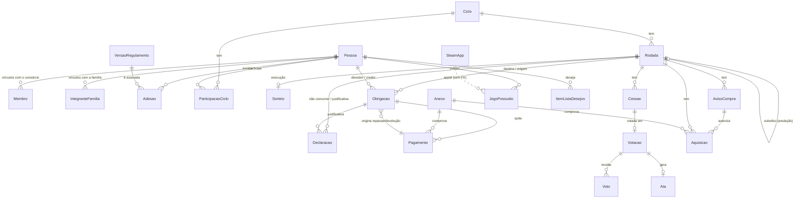

# 05 — Modelo de dados

PostgreSQL 17+ com Prisma ORM 7.10.x (versões em [08](08-arquitetura-e-qualidade.md)). **Schema validado com `prisma validate` 7.10.0 e SQL do §3 aplicado e testado em Postgres 17 (PGlite) em 24/09/2026.**

Convenções:
- Modelos e campos em **português sem acento** (ADR-004); **tabelas** em `snake_case` via `@@map`; **colunas com o nome do campo (camelCase)** — no SQL manual, sempre entre aspas (`"pessoaId"`).
- PK `uuid`; instantes em `timestamptz(3)`; datas de negócio em `date` via o tipo `DataCivil` (C-DATA, 02 §0); dinheiro em `Int` (centavos).
- ATAs são referenciadas pelo **número**, como no Regulamento (`ataXNumero Int?`, sem FK).
- **Instantes de negócio são preenchidos explicitamente com `agora()` pelo serviço** (C-TEMPO); não há `@default(now())` neles.
- Guarda-se **fato**, não estado derivado (C-DERIVADO). O que é calculado está no §4.
- Relações reversas declaradas explicitamente; relação nomeada (`@relation("Nome")`) só quando há 2+ relações entre o mesmo par de modelos.

## 1. Diagrama (núcleo)



## 2. Schema Prisma (`prisma/schema.prisma`)

A URL do banco fica em `prisma.config.ts` (padrão do Prisma 7; ver 08 §3).

```prisma
generator client {
  provider = "prisma-client"
  output   = "../src/generated/prisma"
}

datasource db {
  provider = "postgresql"
}

// ───────────────────────── Enums ─────────────────────────
enum TipoChavePix {
  ALEATORIA
  EMAIL
  TELEFONE
  CPF
  CNPJ
}

enum OrigemMembro {
  FUNDADOR
  ADMISSAO
}

enum StatusMembro {
  AGUARDANDO_ADESAO
  AGUARDANDO_CICLO
  ATIVO
  IMPOSSIBILITADO
  ENCERRADO
}

enum MotivoEncerramentoMembro {
  SAIDA_VOLUNTARIA
  SAIDA_DA_FAMILIA
  EXCLUSAO_ART30
  EXCLUSAO_ART35
  NAO_CONFIRMOU_ART44
  ADMISSAO_CADUCOU
}

enum OrigemIntegrante {
  PRE_EXISTENTE
  CONVITE
}

enum StatusIntegrante {
  CONVITE_AUTORIZADO
  CONVITE_CADUCOU
  ATIVO
  REMOCAO_AUTORIZADA
  REMOVIDO
  SAIU
}

enum StatusCiclo {
  PLANEJADO
  EM_ANDAMENTO
  EM_REVISAO
  ENCERRADO
  CANCELADO
}

enum StatusRodada {
  AGENDADA
  CONTEMPLADA
  SEM_CONTEMPLADO
  FECHADA
  ANULADA
  CANCELADA
}

enum TipoContemplacao {
  SORTEIO
  UNICO_ELEGIVEL
  OBRIGATORIA_ART14
}

enum MotivoSemContemplado {
  NENHUM_ELEGIVEL
  ULTIMO_IMPOSSIBILITADO
}

enum MotivoFechamento {
  AQUISICAO_CONCLUIDA
  PRAZO_COM_AQUISICAO
  TRANSFERIDO_COMO_SOBRA
  CONVERTIDO_POR_ATA
}

enum TipoDeclaracao {
  NAO_CONCORRER
  JUSTIFICATIVA_PRORROGACAO
  IMPOSSIBILIDADE_PAGAMENTO
  SAIDA_CONSORCIO
  SAIDA_FAMILIA
  CONFIRMA_PROXIMO_CICLO
  RECUSA_PROXIMO_CICLO
}

enum StatusCessao {
  AGUARDANDO_ACEITE
  EM_VOTACAO
  APROVADA
  REJEITADA
  CANCELADA
}

enum TipoObrigacao {
  CONTRIBUICAO
  SOBRA
  REPASSE_CESSAO
  RATEIO_SOBRA
  DEVOLUCAO
}

enum StatusPagamento {
  DECLARADO
  CONFIRMADO
  CONTESTADO
  INVALIDADO
}

enum MotivoContestacao {
  NAO_RECEBIDO
  VALOR_DIVERGENTE
  DATA_DIVERGENTE
}

enum TipoProduto {
  JOGO
  DLC
  PACOTE
}

enum OrigemProduto {
  LOJA_STEAM
  CHAVE_EXTERNA
}

enum OrigemNaLista {
  LISTA_DO_SORTEADO
  INCLUIDO_APOS_SORTEIO
  LISTA_DE_OUTRO_MEMBRO
  FORA_DAS_LISTAS
}

enum VerificacaoBiblioteca {
  PENDENTE
  VERIFICADO
  NAO_ENCONTRADO
  NAO_VERIFICAVEL
}

enum IrregularidadeAquisicao {
  SEM_AVISO
  ANTES_DA_AUTORIZACAO
  DURANTE_VOTACAO_VETO
  DURANTE_VOTACAO_CESSAO
  APOS_PRAZO
  JOGO_BLOQUEADO
  PRODUTO_DIFERENTE_DO_AVISO
  SEGUNDA_AQUISICAO
  SEM_AUTORIZACAO_16IV
  CONTA_DIFERENTE_DO_CONTEMPLADO
}

enum TipoBloqueio {
  CATEGORIA
  JOGO
}

enum AssuntoVotacao {
  VETO_JOGO
  JOGO_DE_OUTRO_MEMBRO
  EXCLUSAO_BLOQUEIO
  CESSAO_VEZ
  ADMISSAO_MEMBRO
  CONVITE_INTEGRANTE
  REMOCAO_INTEGRANTE
  PERMANENCIA_ART30
  CONTINUIDADE_CONSORCIO
  ALTERACAO_REGULAMENTO
  CASO_OMISSO
  CONTROVERSIA
  OUTRO
}

enum StatusVotacao {
  ABERTA
  APROVADA
  REJEITADA
  CANCELADA
}

enum MotivoEncerramentoVotacao {
  QUORUM_ATINGIDO
  APROVACAO_IMPOSSIVEL
  PRAZO
  CANCELADA_PELO_CONVOCANTE
  PREJUDICADA
}

enum OpcaoVoto {
  FAVOR
  CONTRA
  ABSTENCAO
}

enum TipoAnexo {
  COMPROVANTE_PIX
  COMPROVANTE_COMPRA
  COMPROVANTE_REEMBOLSO
  EVIDENCIA_SORTEIO
  EVIDENCIA_GRUPO
  EVIDENCIA_VALIDACAO
  PRINT_BIBLIOTECA
  ASSINATURA_PDF
  OUTRO
}

enum AtorTipo {
  MEMBRO
  SISTEMA
  OPERADOR
}

enum OrigemItemDesejo {
  STEAM
  MANUAL
}

// ─────────────────── Pessoas, membros, família ───────────────────
model Pessoa {
  id                    String        @id @default(uuid()) @db.Uuid
  nome                  String? // obrigatório p/ membro e candidato (validado na app)
  apelido               String
  steamId64             String?       @unique @db.VarChar(17)
  steamNick             String?
  steamAvatarUrl        String?
  steamPerfilUrl        String?
  steamPerfilPublico    Boolean?
  steamJogosPublicos    Boolean?
  steamDesejosPublicos  Boolean?
  steamSincronizadoEm   DateTime?     @db.Timestamptz(3)
  chavePix              String?
  tipoChavePix          TipoChavePix?
  chavePixAlteradaEm    DateTime?     @db.Timestamptz(3)
  maioridadeDeclaradaEm DateTime?     @db.Timestamptz(3)
  anonimizadaEm         DateTime?     @db.Timestamptz(3)
  criadoEm              DateTime      @default(now()) @db.Timestamptz(3)
  atualizadoEm          DateTime      @updatedAt @db.Timestamptz(3)

  membros             Membro[]
  integrantes         IntegranteFamilia[]
  adesoes             Adesao[]
  participacoes       ParticipacaoCiclo[]
  declaracoes         Declaracao[]
  rodadasSorteado     Rodada[]            @relation("RodadaSorteadoOriginal")
  rodadasContemplado  Rodada[]            @relation("RodadaContemplado")
  cessoesCedidas      Cessao[]            @relation("CessaoCedente")
  cessoesRecebidas    Cessao[]            @relation("CessaoBeneficiario")
  obrigacoesDevedor   Obrigacao[]         @relation("ObrigacaoDevedor")
  obrigacoesCredor    Obrigacao[]         @relation("ObrigacaoCredor")
  pagamentosRecebidos Pagamento[]
  avisos              AvisoCompra[]
  votos               Voto[]
  sessoes             Sessao[]
  jogos               JogoPossuido[]
  desejos             ItemListaDesejos[]

  @@map("pessoa")
}

model Membro {
  id                    String                    @id @default(uuid()) @db.Uuid
  pessoaId              String                    @db.Uuid
  pessoa                Pessoa                    @relation(fields: [pessoaId], references: [id])
  origem                OrigemMembro
  status                StatusMembro
  ataAdmissaoNumero     Int?
  impossibilitadoDesde  DateTime?                 @db.Timestamptz(3)
  ativadoEm             DateTime?                 @db.Timestamptz(3)
  encerradoEm           DateTime?                 @db.Timestamptz(3)
  motivoEncerramento    MotivoEncerramentoMembro?
  ataEncerramentoNumero Int?
  criadoEm              DateTime                  @default(now()) @db.Timestamptz(3)

  @@index([pessoaId])
  @@map("membro")
}

model IntegranteFamilia {
  id                      String           @id @default(uuid()) @db.Uuid
  pessoaId                String           @db.Uuid
  pessoa                  Pessoa           @relation(fields: [pessoaId], references: [id])
  steamId64               String?          @db.VarChar(17) // conta do vínculo (snapshot; muda só por REVINCULAR_STEAM)
  origem                  OrigemIntegrante
  status                  StatusIntegrante
  entrouEm                DateTime?        @db.Date
  saiuEm                  DateTime?        @db.Date
  vagaBloqueadaAte        DateTime?        @db.Date
  justificativaVaga       String?
  ataConviteNumero        Int?
  ataRemocaoNumero        Int?
  execucaoRegistradaPorId String?          @db.Uuid
  criadoEm                DateTime         @default(now()) @db.Timestamptz(3)

  @@index([pessoaId])
  @@map("integrante_familia")
}

// ─────────────────── Regulamento ───────────────────
model VersaoRegulamento {
  id               String    @id @default(uuid()) @db.Uuid
  ordem            Int       @unique // 0 = 1.0, 1 = 1.1, … (comparação numérica)
  numero           String    @unique // exibição: "1." + ordem
  textoMarkdown    String
  parametros       Json // parametrosSchema (zod) — RN-REG-06
  sha256           String    @db.Char(64) // C-HASH
  resumoAlteracoes String?
  ataNumero        Int?      @unique // null na 1.0
  aprovadaEm       DateTime? @db.Timestamptz(3)
  vigenteDesde     DateTime? @db.Timestamptz(3) // null = 1.0 aguardando assinaturas
  criadoEm         DateTime  @default(now()) @db.Timestamptz(3)

  adesoes  Adesao[]
  rodadas  Rodada[]
  votacoes Votacao[]

  @@map("versao_regulamento")
}

model Adesao {
  id                String            @id @default(uuid()) @db.Uuid
  pessoaId          String            @db.Uuid
  pessoa            Pessoa            @relation(fields: [pessoaId], references: [id])
  versaoId          String            @db.Uuid
  versao            VersaoRegulamento @relation(fields: [versaoId], references: [id])
  sha256Versao      String            @db.Char(64)
  nome              String
  steamNick         String
  codigoAmigo       String
  chavePixMascarada String // 4 últimos caracteres
  declaracao        String // texto literal aceito
  assinadaEm        DateTime          @db.Timestamptz(3)
  anexoPdfId        String?           @db.Uuid

  @@unique([pessoaId, versaoId, sha256Versao, codigoAmigo])
  @@map("adesao")
}

// ─────────────────── Ciclo, rodada, sorteio ───────────────────
model Ciclo {
  id                    String      @id @default(uuid()) @db.Uuid
  numero                Int         @unique
  dataInicio            DateTime    @db.Date // sempre dia 3
  status                StatusCiclo
  concluidoEm           DateTime?   @db.Timestamptz(3)
  encerradoEm           DateTime?   @db.Timestamptz(3)
  semCicloSeguinte      Boolean     @default(false)
  ataEncerramentoNumero Int?
  criadoEm              DateTime    @default(now()) @db.Timestamptz(3)

  rodadas       Rodada[]
  participacoes ParticipacaoCiclo[]
  declaracoes   Declaracao[]

  @@map("ciclo")
}

model ParticipacaoCiclo {
  id                     String    @id @default(uuid()) @db.Uuid
  cicloId                String    @db.Uuid
  ciclo                  Ciclo     @relation(fields: [cicloId], references: [id])
  pessoaId               String    @db.Uuid
  pessoa                 Pessoa    @relation(fields: [pessoaId], references: [id])
  entrouEm               DateTime  @db.Timestamptz(3) // corte da 1ª rodada
  saiuEm                 DateTime? @db.Timestamptz(3) // RN-CAD-04
  contribuicoesSuspensas Boolean   @default(false)
  ataSuspensaoNumero     Int?

  @@unique([cicloId, pessoaId])
  @@map("participacao_ciclo")
}

model Rodada {
  id                           String                @id @default(uuid()) @db.Uuid
  cicloId                      String                @db.Uuid
  ciclo                        Ciclo                 @relation(fields: [cicloId], references: [id])
  sequencia                    Int // única entre as não ANULADA/CANCELADA (índice parcial)
  mesReferencia                String                @db.Char(7) // "2026-10"
  agendadaPara                 DateTime              @db.Timestamptz(3)
  status                       StatusRodada          @default(AGENDADA)
  executadaEm                  DateTime?             @db.Timestamptz(3)
  dataSorteio                  DateTime?             @db.Date
  atrasada                     Boolean               @default(false)
  tipoContemplacao             TipoContemplacao?
  motivoSemContemplado         MotivoSemContemplado?
  sorteadoOriginalId           String?               @db.Uuid
  sorteadoOriginal             Pessoa?               @relation("RodadaSorteadoOriginal", fields: [sorteadoOriginalId], references: [id])
  contempladoId                String?               @db.Uuid
  contemplado                  Pessoa?               @relation("RodadaContemplado", fields: [contempladoId], references: [id])
  versaoRegulamentoId          String?               @db.Uuid
  versaoRegulamento            VersaoRegulamento?    @relation(fields: [versaoRegulamentoId], references: [id])
  contribuicaoCentavos         Int?
  pagantesNoCorte              Int? // nº de CONTRIBUICAO criadas (inclui a autoquitada)
  prazoCompraAte               DateTime?             @db.Timestamptz(3) // limite exclusivo
  fechamentoSolicitado         MotivoFechamento? // (a) concluída, (c) transferir como SOBRA, (d) ATA — gravado mesmo com a anterior aberta
  fechamentoSolicitadoEm       DateTime?             @db.Timestamptz(3)
  multiplasAquisicoesAtaNumero Int?
  fechadaEm                    DateTime?             @db.Timestamptz(3)
  motivoFechamento             MotivoFechamento?
  gastoCentavos                Int?
  sobraCentavos                Int?
  rodadaAnuladaId              String?               @unique @db.Uuid
  rodadaAnulada                Rodada?               @relation("RodadaAnulada", fields: [rodadaAnuladaId], references: [id])
  substituta                   Rodada?               @relation("RodadaAnulada")
  anuladaEm                    DateTime?             @db.Timestamptz(3)
  ataAnulacaoNumero            Int?
  criadaEm                     DateTime              @default(now()) @db.Timestamptz(3)

  sorteio              Sorteio?
  declaracoes          Declaracao[]
  cessoes              Cessao[]
  obrigacoes           Obrigacao[]   @relation("ObrigacaoRodada")
  obrigacoesOriginadas Obrigacao[]   @relation("ObrigacaoRodadaOrigem")
  avisos               AvisoCompra[]
  aquisicoes           Aquisicao[]

  @@index([status, agendadaPara])
  @@map("rodada")
}

model Sorteio {
  // só inserção (trigger)
  id              String   @id @default(uuid()) @db.Uuid
  rodadaId        String   @unique @db.Uuid
  rodada          Rodada   @relation(fields: [rodadaId], references: [id])
  corteEm         DateTime @db.Timestamptz(3)
  disparadoPorId  String?  @db.Uuid // null = SISTEMA
  algoritmoVersao String
  snapshot        Json
  snapshotSha256  String   @db.Char(64)
  elegiveisIds    String[] @db.Uuid
  indice          Int?
  contempladoId   String?  @db.Uuid

  @@map("sorteio")
}

model Declaracao {
  id               String         @id @default(uuid()) @db.Uuid
  tipo             TipoDeclaracao
  pessoaId         String         @db.Uuid // sujeito do ato
  pessoa           Pessoa         @relation(fields: [pessoaId], references: [id])
  rodadaId         String?        @db.Uuid // NAO_CONCORRER; JUSTIFICATIVA antes do sorteio
  rodada           Rodada?        @relation(fields: [rodadaId], references: [id])
  obrigacaoId      String?        @db.Uuid // JUSTIFICATIVA depois do sorteio
  obrigacao        Obrigacao?     @relation(fields: [obrigacaoId], references: [id])
  cicloId          String?        @db.Uuid // CONFIRMA/RECUSA: o ciclo PLANEJADO
  ciclo            Ciclo?         @relation(fields: [cicloId], references: [id])
  texto            String?
  efetivaEm        DateTime       @db.Timestamptz(3) // = registradaEm, ou hora da msg no GRUPO
  registradaEm     DateTime       @db.Timestamptz(3)
  registradaPorId  String         @db.Uuid // ≠ pessoaId ⇒ transcrição (RN-GER-05)
  evidenciaAnexoId String?        @db.Uuid // obrigatório em transcrição
  revogadaEm       DateTime?      @db.Timestamptz(3)

  @@index([pessoaId, tipo])
  @@map("declaracao")
}

model Cessao {
  id             String       @id @default(uuid()) @db.Uuid
  rodadaId       String       @db.Uuid
  rodada         Rodada       @relation(fields: [rodadaId], references: [id])
  cedenteId      String       @db.Uuid
  cedente        Pessoa       @relation("CessaoCedente", fields: [cedenteId], references: [id])
  beneficiarioId String       @db.Uuid
  beneficiario   Pessoa       @relation("CessaoBeneficiario", fields: [beneficiarioId], references: [id])
  status         StatusCessao
  cienciaPrazo   Boolean      @default(false)
  propostaEm     DateTime     @db.Timestamptz(3)
  aceitaEm       DateTime?    @db.Timestamptz(3)
  encerradaEm    DateTime?    @db.Timestamptz(3)
  votacaoId      String?      @unique @db.Uuid
  votacao        Votacao?     @relation(fields: [votacaoId], references: [id])

  @@map("cessao")
}

// ─────────────────── Financeiro ───────────────────
model Obrigacao {
  id                   String        @id @default(uuid()) @db.Uuid
  tipo                 TipoObrigacao
  rodadaId             String        @db.Uuid // ver §5 (semântica por tipo)
  rodada               Rodada        @relation("ObrigacaoRodada", fields: [rodadaId], references: [id])
  rodadaOrigemId       String?       @db.Uuid // SOBRA/RATEIO: rodada que gerou
  rodadaOrigem         Rodada?       @relation("ObrigacaoRodadaOrigem", fields: [rodadaOrigemId], references: [id])
  pagamentoOrigemId    String?       @db.Uuid // REPASSE_CESSAO/DEVOLUCAO: pagamento que originou
  pagamentoOrigem      Pagamento?    @relation("ObrigacaoPagamentoOrigem", fields: [pagamentoOrigemId], references: [id])
  aquisicaoReembolsoId String?       @db.Uuid // SOBRA/RATEIO complementar (RN-FIN-16)
  aquisicaoReembolso   Aquisicao?    @relation(fields: [aquisicaoReembolsoId], references: [id])
  devedorId            String        @db.Uuid
  devedor              Pessoa        @relation("ObrigacaoDevedor", fields: [devedorId], references: [id])
  credorId             String        @db.Uuid // muda só na cessão (auditado)
  credor               Pessoa        @relation("ObrigacaoCredor", fields: [credorId], references: [id])
  valorCentavos        Int
  vencimentoEm         DateTime      @db.Timestamptz(3) // limite exclusivo (fim do dia)
  autoquitada          Boolean       @default(false)
  justificativa        String? // cópia da Declaracao JUSTIFICATIVA
  justificadaEm        DateTime?     @db.Timestamptz(3) // = efetivaEm da Declaracao
  canceladaEm          DateTime?     @db.Timestamptz(3)
  motivoCancelamento   String?
  ataNumero            Int?
  criadaEm             DateTime      @db.Timestamptz(3)

  pagamentos     Pagamento[]  @relation("PagamentoObrigacao")
  justificativas Declaracao[]

  @@index([devedorId])
  @@index([credorId])
  @@index([rodadaId, tipo])
  @@map("obrigacao")
}

model Pagamento {
  id                       String             @id @default(uuid()) @db.Uuid
  obrigacaoId              String             @db.Uuid
  obrigacao                Obrigacao          @relation("PagamentoObrigacao", fields: [obrigacaoId], references: [id])
  recebedorId              String             @db.Uuid // para quem foi o Pix (default: credor vigente em pixEm)
  recebedor                Pessoa             @relation(fields: [recebedorId], references: [id])
  valorCentavos            Int
  pixEm                    DateTime           @db.Timestamptz(3) // do comprovante
  chavePixDestinoMascarada String?
  formaDiversa             Boolean            @default(false)
  status                   StatusPagamento
  comprovanteId            String?            @db.Uuid
  comprovante              Anexo?             @relation("PagamentoComprovante", fields: [comprovanteId], references: [id])
  registradoPorId          String             @db.Uuid
  registradoEm             DateTime           @db.Timestamptz(3)
  confirmadoEm             DateTime?          @db.Timestamptz(3)
  contestadoEm             DateTime?          @db.Timestamptz(3)
  motivoContestacao        MotivoContestacao?
  detalheContestacao       String?
  invalidadoEm             DateTime?          @db.Timestamptz(3)
  ataNumero                Int?

  obrigacoesDerivadas Obrigacao[] @relation("ObrigacaoPagamentoOrigem")

  @@index([obrigacaoId])
  @@map("pagamento")
}

// ─────────────────── Jogo do mês ───────────────────
model AvisoCompra {
  id                      String        @id @default(uuid()) @db.Uuid
  rodadaId                String        @db.Uuid
  rodada                  Rodada        @relation(fields: [rodadaId], references: [id])
  contempladoId           String        @db.Uuid
  contemplado             Pessoa        @relation(fields: [contempladoId], references: [id])
  appId                   Int // PACOTE: app principal, escolhido entre os incluídos
  pacoteId                Int? // sub/bundle da loja
  appIdsIncluidos         Int[]
  nome                    String
  tipo                    TipoProduto
  origem                  OrigemProduto
  lojaExterna             String?
  precoReferenciaCentavos Int?
  origemNaLista           OrigemNaLista
  validacoes              Json // Validacao[] (snapshot, RN-COM-04)
  declaracoes             Json // { regra, texto, evidenciaAnexoId? }[]
  snapshotSteam           Json?
  declarantesPosseIds     String[]      @db.Uuid // art. 16, IV
  avisadoEm               DateTime      @db.Timestamptz(3)
  janelaVetoAte           DateTime      @db.Timestamptz(3)
  substituidoEm           DateTime?     @db.Timestamptz(3)

  aquisicoes Aquisicao[]

  @@index([rodadaId])
  @@map("aviso_compra")
}

model Aquisicao {
  id                        String                    @id @default(uuid()) @db.Uuid
  rodadaId                  String                    @db.Uuid
  rodada                    Rodada                    @relation(fields: [rodadaId], references: [id])
  avisoId                   String?                   @db.Uuid
  aviso                     AvisoCompra?              @relation(fields: [avisoId], references: [id])
  appId                     Int
  nome                      String
  compradaEm                DateTime                  @db.Timestamptz(3)
  valorCentavos             Int // total debitado em BRL
  comprovanteId             String                    @db.Uuid
  comprovante               Anexo                     @relation("AquisicaoComprovante", fields: [comprovanteId], references: [id])
  contaSteamId64            String                    @db.VarChar(17)
  preVenda                  Boolean                   @default(false)
  irregularidades           IrregularidadeAquisicao[]
  verificacaoBiblioteca     VerificacaoBiblioteca     @default(PENDENTE)
  compartilhamentoPerdidoEm DateTime?                 @db.Timestamptz(3)
  registradaPorId           String                    @db.Uuid // = contemplado vigente
  registradaEm              DateTime                  @db.Timestamptz(3)
  reembolsoValorCentavos    Int?
  reembolsadaEm             DateTime?                 @db.Timestamptz(3)
  reembolsoRegistradoEm     DateTime?                 @db.Timestamptz(3)
  reembolsoComprovanteId    String?                   @db.Uuid
  complementarCentavos      Int? // RN-FIN-16: SOBRA complementar gerada por este reembolso
  reembolsoComprovante      Anexo?                    @relation("AquisicaoReembolsoComprovante", fields: [reembolsoComprovanteId], references: [id])
  regularizadaAtaNumero     Int?

  sobrasComplementares Obrigacao[]

  @@index([rodadaId])
  @@map("aquisicao")
}

model JogoBloqueado {
  // Anexo I
  numero            Int          @id // MAX+1 sob travar(tx,'ata'); nunca reaproveitado
  tipo              TipoBloqueio
  nome              String
  appIds            Int[]
  dataVeto          DateTime?    @db.Date
  origemTexto       String? // "Versão 1.0"
  motivo            String
  ataInclusaoNumero Int?         @unique
  protegida         Boolean      @default(false)
  excluidoEm        DateTime?    @db.Timestamptz(3)
  ataExclusaoNumero Int?

  @@map("jogo_bloqueado")
}

// ─────────────────── Votações e ATAs ───────────────────
model Votacao {
  id                  String                     @id @default(uuid()) @db.Uuid
  assunto             AssuntoVotacao
  proposicao          String
  justificativa       String
  efeito              Json // efeitoSchema (zod), imutável
  chaveObjeto         String // RN-VOT-01
  convocadaPorId      String                     @db.Uuid
  abertaEm            DateTime                   @db.Timestamptz(3)
  encerraEm           DateTime                   @db.Timestamptz(3)
  eleitoresIds        String[]                   @db.Uuid
  impedidosIds        String[]                   @db.Uuid
  n                   Int
  quorum              Int
  versaoRegulamentoId String                     @db.Uuid
  versaoRegulamento   VersaoRegulamento          @relation(fields: [versaoRegulamentoId], references: [id])
  status              StatusVotacao              @default(ABERTA)
  encerradaEm         DateTime?                  @db.Timestamptz(3)
  motivoEncerramento  MotivoEncerramentoVotacao?
  efeitoAplicadoEm    DateTime?                  @db.Timestamptz(3)
  efeitoNaoAplicavel  String?

  votos  Voto[]
  ata    Ata?
  cessao Cessao?

  @@index([status, encerraEm])
  @@map("votacao")
}

model Voto {
  // só inserção (trigger)
  votacaoId String    @db.Uuid
  votacao   Votacao   @relation(fields: [votacaoId], references: [id])
  pessoaId  String    @db.Uuid
  pessoa    Pessoa    @relation(fields: [pessoaId], references: [id])
  opcao     OpcaoVoto
  votadoEm  DateTime  @db.Timestamptz(3)

  @@id([votacaoId, pessoaId])
  @@map("voto")
}

model Ata {
  // só inserção (trigger)
  numero            Int      @id // MAX+1 sob travar(tx,'ata'): sem lacunas
  votacaoId         String   @unique @db.Uuid
  votacao           Votacao  @relation(fields: [votacaoId], references: [id])
  data              DateTime @db.Date
  markdown          String // renderização imutável (Anexo II + extras)
  sha256            String   @db.Char(64) // sha256(markdown) — C-HASH
  retificaAtaNumero Int?
  geradaEm          DateTime @db.Timestamptz(3)

  @@map("ata")
}

// ─────────────────── Anexos, auditoria, controle ───────────────────
model Anexo {
  id           String    @id @default(uuid()) @db.Uuid
  tipo         TipoAnexo
  mime         String // detectado pelos magic bytes
  tamanhoBytes Int
  sha256       String    @db.Char(64)
  conteudo     Bytes? // ponytail: bytea; migrar p/ S3/R2 se passar de ~1 GB
  linkExterno  String? // https apenas
  entidade     String? // "pagamento" | "aquisicao" | "declaracao" | "aviso" | "rodada" | "adesao"
  entidadeId   String?   @db.Uuid
  enviadoPorId String    @db.Uuid
  enviadoEm    DateTime  @db.Timestamptz(3)

  pagamentos Pagamento[] @relation("PagamentoComprovante")
  aquisicoes Aquisicao[] @relation("AquisicaoComprovante")
  reembolsos Aquisicao[] @relation("AquisicaoReembolsoComprovante")

  @@index([sha256])
  @@index([entidade, entidadeId])
  @@map("anexo")
}

model EventoAuditoria {
  // só inserção (trigger)
  id           Int      @id @default(autoincrement())
  ocorridoEm   DateTime @db.Timestamptz(3)
  atorTipo     AtorTipo
  atorPessoaId String?  @db.Uuid
  acao         String // "pagamento.registrar", "votacao.aprovar", ...
  entidade     String
  entidadeId   String
  dados        Json // { antes?, depois?, motivo? } — chavePix* mascarado; sem conteudo/tokenHash
  ataNumero    Int?

  @@index([entidade, entidadeId])
  @@index([ocorridoEm])
  @@map("evento_auditoria")
}

model Controle {
  // estado técnico: 'tick' (lease), 'steam_pausa', 'ultimo_tick'
  chave        String    @id
  ate          DateTime? @db.Timestamptz(3)
  valor        Json?
  atualizadoEm DateTime  @updatedAt @db.Timestamptz(3)

  @@map("controle")
}

// ─────────────────── Sessão e login ───────────────────
model Sessao {
  id         String    @id @default(uuid()) @db.Uuid
  tokenHash  String    @unique @db.Char(64)
  pessoaId   String    @db.Uuid
  pessoa     Pessoa    @relation(fields: [pessoaId], references: [id])
  criadaEm   DateTime  @db.Timestamptz(3)
  expiraEm   DateTime  @db.Timestamptz(3)
  revogadaEm DateTime? @db.Timestamptz(3)
  userAgent  String?

  @@index([pessoaId])
  @@map("sessao")
}

model NonceOpenId {
  // anti-replay (RN-STM-01); limpar > 1 dia no tick
  nonce   String   @id
  usadoEm DateTime @db.Timestamptz(3)

  @@map("nonce_openid")
}

// ─────────────────── Cache Steam ───────────────────
model SteamApp {
  appId               Int       @id
  nome                String?
  tipo                String? // game | dlc | music | demo | ...
  gratuito            Boolean?
  precoFinalCentavos  Int?
  categorias          Int[] // 62 = Family Sharing
  descritoresConteudo Int[] // 3 = Adult Only Sexual Content
  jogoBaseAppId       Int?
  emBreve             Boolean?
  imagemUrl           String?
  sucesso             Boolean? // false = appdetails success:false
  detalhesEm          DateTime? @db.Timestamptz(3)
  precoEm             DateTime? @db.Timestamptz(3)
  prioridadeSync      Int       @default(0) // 3 aviso · 2 desejo · 1 possuído

  @@index([prioridadeSync, detalhesEm])
  @@map("steam_app")
}

model JogoPossuido {
  pessoaId       String   @db.Uuid
  pessoa         Pessoa   @relation(fields: [pessoaId], references: [id])
  appId          Int
  minutosJogados Int      @default(0)
  sincronizadoEm DateTime @db.Timestamptz(3)

  @@id([pessoaId, appId])
  @@index([appId])
  @@map("jogo_possuido")
}

model ItemListaDesejos {
  id              String           @id @default(uuid()) @db.Uuid
  pessoaId        String           @db.Uuid
  pessoa          Pessoa           @relation(fields: [pessoaId], references: [id])
  origem          OrigemItemDesejo
  appId           Int?
  tituloLivre     String?
  posicao         Int
  prioridadeSteam Int?
  adicionadoEm    DateTime         @db.Timestamptz(3) // Steam: date_added
  observacao      String?

  @@unique([pessoaId, origem, appId])
  @@map("item_lista_desejos")
}
```

## 3. Constraints em SQL (migração manual `0002_regras`)

O Prisma não expressa índices parciais, CHECKs e triggers. Criar com `prisma migrate dev --create-only --name regras` e colar o SQL abaixo. Os índices manuais são todos **parciais**, e o `migrate dev` não os derruba (índice total manual seria removido como *drift*).

```sql
-- Unicidades parciais
CREATE UNIQUE INDEX membro_um_vinculo_aberto ON membro ("pessoaId") WHERE status <> 'ENCERRADO';
CREATE UNIQUE INDEX rodada_sequencia_unica ON rodada ("cicloId", sequencia) WHERE status NOT IN ('ANULADA','CANCELADA');
CREATE UNIQUE INDEX rodada_mes_unico ON rodada ("cicloId", "mesReferencia") WHERE status NOT IN ('ANULADA','CANCELADA');
CREATE UNIQUE INDEX votacao_aberta_por_objeto ON votacao (assunto, "chaveObjeto") WHERE status = 'ABERTA';
CREATE UNIQUE INDEX veto_unico_por_aviso ON votacao ("chaveObjeto") WHERE assunto = 'VETO_JOGO' AND status <> 'CANCELADA';
CREATE UNIQUE INDEX contribuicao_por_devedor ON obrigacao ("rodadaId", "devedorId") WHERE tipo = 'CONTRIBUICAO' AND "canceladaEm" IS NULL;
CREATE UNIQUE INDEX sobra_unica ON obrigacao ("rodadaOrigemId", "aquisicaoReembolsoId") NULLS NOT DISTINCT WHERE tipo = 'SOBRA' AND "canceladaEm" IS NULL;
CREATE UNIQUE INDEX rateio_unico ON obrigacao ("rodadaOrigemId", "credorId", "aquisicaoReembolsoId") NULLS NOT DISTINCT WHERE tipo = 'RATEIO_SOBRA' AND "canceladaEm" IS NULL;
CREATE UNIQUE INDEX obrigacao_por_pagamento ON obrigacao ("pagamentoOrigemId") WHERE "pagamentoOrigemId" IS NOT NULL AND "canceladaEm" IS NULL;
CREATE UNIQUE INDEX declaracao_rodada_ativa ON declaracao (tipo, "pessoaId", "rodadaId")
  WHERE "revogadaEm" IS NULL AND "rodadaId" IS NOT NULL AND tipo IN ('NAO_CONCORRER','JUSTIFICATIVA_PRORROGACAO');
CREATE UNIQUE INDEX justificativa_por_obrigacao ON declaracao ("obrigacaoId")
  WHERE "revogadaEm" IS NULL AND "obrigacaoId" IS NOT NULL AND tipo = 'JUSTIFICATIVA_PRORROGACAO';
CREATE UNIQUE INDEX confirmacao_ciclo_ativa ON declaracao ("pessoaId", "cicloId")
  WHERE "revogadaEm" IS NULL AND tipo IN ('CONFIRMA_PROXIMO_CICLO','RECUSA_PROXIMO_CICLO');
CREATE UNIQUE INDEX cessao_ativa_por_rodada ON cessao ("rodadaId") WHERE status IN ('AGUARDANDO_ACEITE','EM_VOTACAO');
CREATE UNIQUE INDEX aviso_ativo_por_rodada ON aviso_compra ("rodadaId") WHERE "substituidoEm" IS NULL;

-- Integridade
ALTER TABLE obrigacao ADD CONSTRAINT obrigacao_valor_positivo CHECK ("valorCentavos" > 0);
ALTER TABLE obrigacao ADD CONSTRAINT obrigacao_partes CHECK (("devedorId" = "credorId") = autoquitada);
ALTER TABLE pagamento ADD CONSTRAINT pagamento_valor_positivo CHECK ("valorCentavos" > 0);
ALTER TABLE pagamento ADD CONSTRAINT pagamento_comprovante CHECK ("comprovanteId" IS NOT NULL OR "formaDiversa");
ALTER TABLE aquisicao ADD CONSTRAINT aquisicao_valor CHECK ("valorCentavos" > 0);
ALTER TABLE aquisicao ADD CONSTRAINT aquisicao_reembolso
  CHECK ("reembolsoValorCentavos" IS NULL OR "reembolsoValorCentavos" BETWEEN 1 AND "valorCentavos");
ALTER TABLE pessoa ADD CONSTRAINT pessoa_steamid CHECK ("steamId64" IS NULL OR
  ("steamId64" ~ '^[0-9]{17}$' AND "steamId64"::bigint BETWEEN 76561197960265729 AND 76561202255233023));
ALTER TABLE ciclo ADD CONSTRAINT ciclo_dia3 CHECK (EXTRACT(DAY FROM "dataInicio") = 3);
ALTER TABLE votacao ADD CONSTRAINT votacao_quorum CHECK (quorum = n / 2 + 1);

-- Só inserção
CREATE FUNCTION bloquear_mutacao() RETURNS trigger LANGUAGE plpgsql AS $$
BEGIN RAISE EXCEPTION 'Tabela % é somente-inserção', TG_TABLE_NAME; END $$;
CREATE TRIGGER sorteio_imutavel   BEFORE UPDATE OR DELETE ON sorteio          FOR EACH ROW EXECUTE FUNCTION bloquear_mutacao();
CREATE TRIGGER voto_imutavel      BEFORE UPDATE OR DELETE ON voto             FOR EACH ROW EXECUTE FUNCTION bloquear_mutacao();
CREATE TRIGGER ata_imutavel       BEFORE UPDATE OR DELETE ON ata              FOR EACH ROW EXECUTE FUNCTION bloquear_mutacao();
CREATE TRIGGER adesao_imutavel    BEFORE UPDATE OR DELETE ON adesao           FOR EACH ROW EXECUTE FUNCTION bloquear_mutacao();
CREATE TRIGGER auditoria_imutavel BEFORE UPDATE OR DELETE ON evento_auditoria FOR EACH ROW EXECUTE FUNCTION bloquear_mutacao();
-- Sem DELETE em registros de negócio
CREATE FUNCTION bloquear_delete() RETURNS trigger LANGUAGE plpgsql AS $$
BEGIN RAISE EXCEPTION 'DELETE proibido em %', TG_TABLE_NAME; END $$;
CREATE TRIGGER obrigacao_sem_delete BEFORE DELETE ON obrigacao    FOR EACH ROW EXECUTE FUNCTION bloquear_delete();
CREATE TRIGGER pagamento_sem_delete BEFORE DELETE ON pagamento    FOR EACH ROW EXECUTE FUNCTION bloquear_delete();
CREATE TRIGGER aviso_sem_delete     BEFORE DELETE ON aviso_compra FOR EACH ROW EXECUTE FUNCTION bloquear_delete();
CREATE TRIGGER aquisicao_sem_delete BEFORE DELETE ON aquisicao    FOR EACH ROW EXECUTE FUNCTION bloquear_delete();

-- Linhas de controle técnico
INSERT INTO controle (chave, "atualizadoEm") VALUES ('tick', now()), ('steam_pausa', now()), ('ultimo_tick', now());
```

> Os testes de integração rodam contra um banco com essas migrações; `db push` é proibido. `TRUNCATE ... CASCADE` (limpeza entre testes) não dispara os triggers de linha.

## 4. Dados derivados (não armazenados)

| Derivado | Função | Base |
|---|---|---|
| Perfil de acesso | `perfilDe` (em `src/server/auth/perfil.ts`, lê o banco) | `Membro.status` + obrigações e pagamentos abertos + rodada aberta como contemplado |
| Versão vigente | `versaoVigente(versoes, t)` | maior `ordem` com `vigenteDesde ≤ t` |
| Adesão válida | `adesaoValida(a, versao, pessoa)` | `a.sha256Versao === versao.sha256 ∧ a.codigoAmigo === codigoAmigo(pessoa.steamId64)` |
| Vencimento efetivo | `vencimentoEfetivo(o, params)` | `justificadaEm < vencimentoEm ? addDays(vencimentoEm, diasProrrogacao, {in: tz(SP)}) : vencimentoEm` (04/10 00:00 → 11/10 00:00) |
| Saldo, atraso, quitação | `saldo`, `emAtraso`, `quitada` | `Pagamento` (RN-FIN-06/08) |
| Em dia, postergado | `emDia`, `postergado` | obrigações + corte |
| Contemplados do ciclo, NC | `contempladosDoCiclo` | `Rodada.contempladoId` (não ANULADA/CANCELADA) |
| Participantes previstos | `participantesPrevistos` | fundadores (ciclo 1) ou confirmações + admitidos (RN-CIC-03) |
| Pagantes da rodada | `Rodada.pagantesNoCorte` | **congelado** na contemplação |
| Prêmio, gasto, sobra, complementação | `premio`, `gasto`, `sobra` | obrigações + aquisições (gasto e sobra congelados no fechamento) |
| Rodada contemplada anterior/próxima | `anteriorContemplada`, `proximaContemplada` | ordem `(ciclo.numero, sequencia)`, só `CONTEMPLADA`/`FECHADA` |
| Status do aviso | `statusAviso` | aviso + votações + aquisições + `agora` |
| Exige 16 IV | `exige16IV(aviso)` | V10 do snapshot acusa posse ∨ `declarantesPosseIds.length > 0` |
| Aquisição ativa | `aquisicaoAtiva(a)` | `reembolsoValorCentavos` nulo ou < `valorCentavos` |
| SOBRA pendente (principal e complementar) | `sobrasPendentes(r)` | RN-FIN-14/16 (só com `r` FECHADA) |
| Pendências da rodada | `pendenciasDaRodada` | prazo, aviso, cessão, fechamento anterior |
| Status exibido da votação | `apurarVotacao` | votos + `agora` (materializado pelo tick) |
| Prazo de confirmação do ciclo | `prazoConfirmacao(dataInicio)` | `dataInicio` 00:00 SP (= fim do dia 2) |
| Vagas livres da família | `vagasLivres` | integrantes + `vagaBloqueadaAte` |
| Biblioteca da família | query | `JogoPossuido` ⋈ `SteamApp` (categoria 62) |
| Desbloqueio de conteúdo adulto | consulta | `Votacao` APROVADA com efeito `DESBLOQUEAR_CONTEUDO_ADULTO` para o appId |

## 5. Notas de implementação

- **`Obrigacao.rodadaId` por tipo:** CONTRIBUICAO/SOBRA → rodada à qual o valor se destina; REPASSE_CESSAO → rodada da cessão; RATEIO_SOBRA → a rodada cuja SOBRA é rateada (= `rodadaOrigemId`); DEVOLUCAO → rodada anulada ou da cessão que a originou. Prazos e prorrogação usam a versão gravada em `rodada.versaoRegulamentoId` (C-PARAM).
- **Colunas financeiras mutáveis:** só `Obrigacao.credorId` (redirecionamento na cessão, RN-CES-05) — sempre com auditoria do valor anterior. Em `Rodada`, a reabertura (RN-FIN-13) zera `fechamentoSolicitado*`, `fechadaEm`, `motivoFechamento`, `gastoCentavos` e `sobraCentavos`, com auditoria. `justificativa/justificadaEm`, `canceladaEm` e os campos de status de `Pagamento` são mudanças de estado, nunca de valor.
- **Anexo de link** (gravação de chamada): `mime = 'text/uri-list'`, `tamanhoBytes = 0`, `sha256 = sha256hex(utf8(url))`, `conteudo = null`.
- **Não carregar bytes de anexo por engano:** toda query de `Anexo` usa `omit: { conteudo: true }`, exceto a rota de download.
- **Sem FK de propósito:** arrays de ids (snapshots: `eleitoresIds`, `declarantesPosseIds`, `elegiveisIds`), ids de autoria (`registradoPorId`, `registradaPorId`, `enviadoPorId`, `convocadaPorId`, `disparadoPorId`, `execucaoRegistradaPorId`, `atorPessoaId`), `ata*Numero` e `Declaracao.evidenciaAnexoId`/`Adesao.anexoPdfId` (vínculo pelo `Anexo.entidade`). A auditoria cobre.
- **Seed de desenvolvimento** (`pnpm db:seed:dev`): 5 pessoas fictícias, 1.0 assinada, ciclo com 2 rodadas executadas. **Aborta se `NODE_ENV === 'production'` ou se `pessoa` tiver qualquer linha** (mesma trava do bootstrap).
